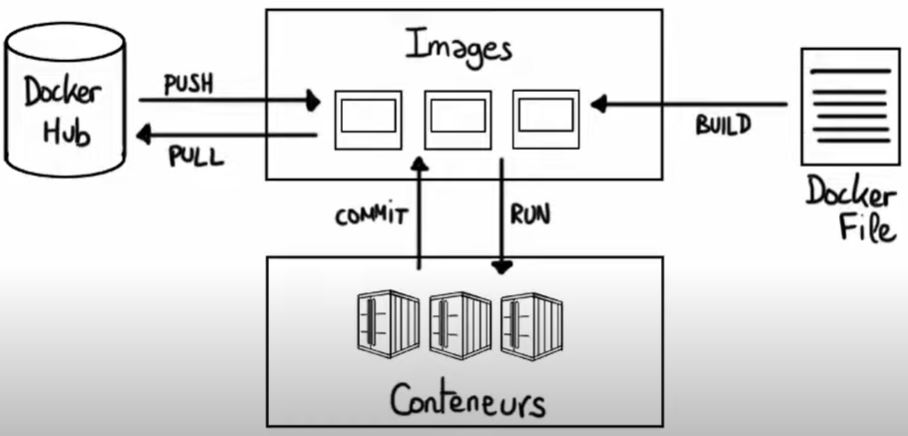

<head>
<style>
#titleMain {color:#808080; font-size:40px; font-weight:bold; font-family:"Cambria"}
#titleSub {color:#677179; font-size:24px; font-weight:bold; font-family: "Verdana"; margin-top:30px; margin-bottom:25px}
#titleSub2 {color:#563C5C; font-size:20px; font-weight:bold; margin-bottom:20px}
#not {color:#1E90FF; font-size:18px "Carnivalee Freakshow"}
#com {color:#FF00FF; font-size:18px "Carnivalee Freakshow"}
#par {color:#32CD32; font-size:18px "Carnivalee Freakshow"}
#val {color:#87CEFA; font-size:18px "Carnivalee Freakshow"}
</style>
</head>

<!-- ```css
<head>
<style>
#bleu {
color:#87CEFA }
</style>
</head>
``` -->

# <div id="titleMain">Les bases sur Docker</div>

L'invite de commande peut être ouverte à partir de n'importe quel répertoire.

## <div id="titleSub">0. Un peu de documentation</div>



## <div id="titleSub">1. Lister toutes les images Docker</div>

<span id="com">docker images </span>

## <div id="titleSub">2. Lister les conteneurs Docker</div>

### <div id="titleSub2">Tous les conteneurs</div>

<span id="com">docker ps </span>
<span id="par">-a </span>
<br>

<div id="not">"-a" pour all .</div>
<br>

### <div id="titleSub2">À l'état démarré</div>

<span id="com">docker ps </span>
<br>

## <div id="titleSub">3. Télécharger une image Docker depuis le Docker Hub</div>

<span id="com">docker pull </span>
<span id="val"> nom_de_la_technologie </span>

## <div id="titleSub">4. Lancer l'exécution d'un conteneur depuis une image en local</div>

### <div id="titleSub2">Recréer</div>

<span id="com">docker run </span>
<span id="par">--rm</span>
<span id="val"> nom_de_l_image</span>
<br>

<div id="not">"--rm" précise que l'on souhaite supprimer l'image si elle existe déjà.</div>
<br>

### <div id="titleSub2">Interaction</div>

<span id="com">docker run </span>
<span id="par">-it</span>
<span id="val"> nom_de_l_image</span>
<br>

<div id="not">"-it" précise que l'on souhaite intéragir avec le conteneur.</div>
<br>

### <div id="titleSub2">Détachement</div>

<span id="com">docker run </span>
<span id="par">-it -d</span>
<span id="val"> nom_de_l_image</span>
<br>

<div id="not">"-d" pour détachement autrement dit en arrière plan.</div>
<br>

### <div id="titleSub2">Port</div>

Nous précisions ici les ports car l'image correspond à un serveur web.
<br>

<span id="com">docker run </span>
<span id="par">-d -p</span>
<span id="val"> port_4:port_2 nom_de_l_image</span>
<br>

<div id="not">"port-4" correspond au port de l'ordiateur et "port_2" correspont au port de Docker. On peut ensuite se rendre sur l'adresse http://127.0.0.1:port_4 .</div>
<br>

## <div id="titleSub">5. Arrêter l'exécution un conteneur en local</div>

<span id="com">docker stop </span>
<span id="val"> conteneur_id</span>
<br>

<div id="not">La valeur "conteneur_id" se retrouve facilement via la commande du point 2. </div>

## <div id="titleSub">6. Ouvrir un shell bash depuis un conteneur en cours d'exécution</div>

<span id="com">docker exec </span>
<span id="par">-ti </span>
<span id="val"> conteneur_id bash</span>
<br>

## <div id="titleSub">7. Laisser Docker supprimer les ressources inutiles</div>

<span id="com">docker system </span>
<span id="par">prune </span>
<br>

## <div id="titleSub">8. Supprimer un conteneur à la main</div>

<span id="com">docker rm </span>
<span id="val">conteneur_id </span>
<br>

## <div id="titleSub">9. Renommer une image</div>

<span id="com">docker image tag </span>
<span id="val">image_id </span>
<span id="val">nouveau_nom_de_l_image</span> /
<span id="val">nouveau_nom_du_tag</span>
<br>

## <div id="titleSub">10. Supprimer une image</div>

<span id="com">docker rmi </span>
<span id="par">--force</span>
<span id="val">nom_de_l_image </span>
<br>