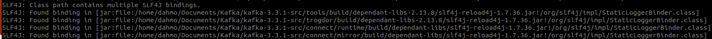
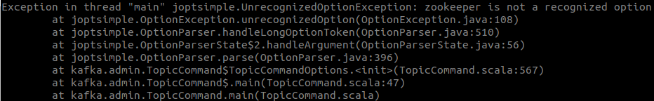

<head>
<style>
#titleMain {color:#808080; font-size:40px; font-weight:bold; font-family:"Cambria"}
#titleSub {color:#677179; font-size:30px; font-weight:bold; font-family: "Verdana"; margin-top:30px; margin-bottom:15px}
#titleSub2 {color:#563C5C; font-size:20px; font-weight:bold; margin-bottom:20px}
#imp {color:#e21313; font:bold 20px "Carnivalee Freakshow"}
#def {color:#90EE90; font-size:18px "Carnivalee Freakshow"}
#not {color:#1E90FF; font-size:18px "Carnivalee Freakshow"}
#att {color:#ffa500; font-size:18px "Carnivalee Freakshow"}
#com {color:#FF00FF; font-size:18px "Carnivalee Freakshow"}
#par {color:#32CD32; font-size:18px "Carnivalee Freakshow"}
#val {color:#87CEFA; font-size:18px "Carnivalee Freakshow"}
</style>
</head>

<!-- ```css
<head>
<style>
#bleu {
color:#87CEFA }
</style>
</head>
``` -->

# <div id="titleMain">Installation et prise en main de Kafka</div>

## <div id="titleSub">0. Infos, conseils et point d'alerte</div>

<span id="def">Apache Kafka est une plateforme de messaging distribuée open source, de type publish-subscribe, spécialement conçue pour le data streaming, le data pipeline et le replay de flux de données, en vue d'opérations rapides et évolutives.</span><br>

```
référence : https://www.tibco.com/fr
```

<span id="not">Utiliser impérativement l'OS Linux, par exemple : Ubunut.</span><br>
<span id="not">Si une commande ne s'exécute pas et qu'il vous suggère l'exécution d'une autre commande, faites-le!</span><br>
<span id="not">Utiliser une application qui permet d'afficher plusieurs consoles, par exemple : Terminator</span><br>
<span id="not">A tout moment, vous pourriez être contraint à installer scala, faites-le uniquement si vous êtes bloqué trop longtemps.</span>

## <div id="titleSub">1. Télécharger Kafka</div>

1. Se rendre sur le site officiel et copier le lien de téléchargement de Kafka

2. Réaliser le téléchargement

pour rappel : 
<span id="com">wget</span>
<span id="val">lien_telechargement</span>

3. Décompresser l'archive

pour rappel : 
<span id="com">tar xzf</span>
<span id="val">archive</span>

## <div id="titleSub">2. Lancer le serveur Zookeeper</div>

<span id="def">Apache ZooKeeper est un logiciel open source de la Apache Software Foundation. Il s'agit d'un logiciel de gestion de configuration pour systèmes distribués. ZooKeeper était un sous projet de Hadoop mais il est désormais un projet top-level à part entière.</span><br>

```
référence : https://fr.wikipedia.org/wiki/Apache_ZooKeeper
```

<span id="com">cd</span>
<span id="val">kafka-3.3.1-src</span><br>

<span id="val">./bin/zookeeper-server-start.sh ./config/zookeeper.properties</span><br>

## <div id="titleSub">3. Tester l'ouverture du port pour Zookeeper</div>

<span id="com">telnet</span>
<span id="val">localhost 2181</span><br>

## <div id="titleSub">4. Lancer le serveur Kafka</div>

<span id="val">./bin/kafka-server-start.sh ./config/server.properties</span>

## <div id="titleSub">5. Tester l'ouverture du port pour Kafka</div>

<span id="com">telnet</span>
<span id="val">localhost 9092</span><br>

## <div id="titleSub">6. Topic</div>

## <div id="titleSub2">6.1 Créer un topic</div>

<span id="att">Attention</span>

Sur la formation "Gérez des flux de données temps réel" sur Openclassrooms, il précise la commande suivante :<br>

<span id="val">./bin/kafka-topics.sh</span>
<span id="par">--create --zookeeper</span>
<span id="val">localhost:2181</span>
<span id="par">--replication-factor</span>
<span id="val">1</span>
<span id="par">--partitions</span>
<span id="val">1</span>
<span id="par">--topic</span>
<span id="val">blabla</span>

1. Si l'erreur suivante apparaît :



Il faut simplement déplacer les archives "slf4j-reload4j-1.7.36" en trop dans un dossier extérieur aux fichiers et dossiers de Kafka.<br>

2. Si l'erreur suivante apparaît :



C'est parce que la ligne de commande est caduque, en effet depuis la version 2.2, on n'a plus besoin de préciser 
<span id="par"> --zookeeper</span>
<span id="val">localhost:2181</span>

Il faut donc utiliser la commande suivante :<br>

<span id="val">./bin/kafka-topics.sh</span>
<span id="par">--create --bootstrap-server</span>
<span id="val">localhost:9092</span>
<span id="par">--replication-factor</span>
<span id="val">1</span>
<span id="par">--partitions</span>
<span id="val">1</span>
<span id="par">--topic</span>
<span id="val">blabla</span>

### <div id="titleSub2">6.2 Lister l'ensemble des topics</div>

<span id="val">./bin/kafka-topics.sh</span>
<span id="par">--list --bootstrap-server</span>
<span id="val">localhost:9092</span>

### <div id="titleSub2">6.3 Affichier les informations d'un topic</div>

<span id="val">./bin/kafka-topics.sh</span>
<span id="par">--describe --bootstrap-server</span>
<span id="val">localhost:9092</span>
<span id="par">--topic</span>
<span id="val">blabla</span>

### <div id="titleSub2">6.4 Modifier le nombre de partitions d'un topic</div>

<span id="val">./bin/kafka-topics.sh</span>
<span id="par">--alter --bootstrap-server</span>
<span id="val">localhost:9092</span>
<span id="par">--topic</span>
<span id="val">blabla</span>
<span id="par">--partitions</span>
<span id="val">2</span>

## <div id="titleSub">7 Producer</div>

### <div id="titleSub2">7.1 Définir la console active comme le producer</div>

<span id="val">./bin/kafka-console-producer.sh</span>
<span id="par">--broker-list</span>
<span id="val">localhost:9092</span>
<span id="par">--timeout</span>
<span id="val">0</span>
<span id="par">--topic</span>
<span id="val">blabla</span>

## <div id="titleSub">8 Consumer</div>

### <div id="titleSub2">8.1 Définir la console active comme le consumer</div>

<span id="val">./bin/kafka-console-consumer.sh</span>
<span id="par">--bootstrap-server</span>
<span id="val">localhost:9092</span>
<span id="par">--topic</span>
<span id="val">blabla</span>


### <div id="titleSub2">8.2 Reprendre tous les message depuis le début</div>

<span id="val">./bin/kafka-console-consumer.sh</span>
<span id="par">--bootstrap-server</span>
<span id="val">localhost:9092</span>
<span id="par">--topic</span>
<span id="val">blabla</span>
<span id="par">--from-beginning</span>

### <div id="titleSub2">8.3 Reprendre tous les message qui n'ont pas été consommé par le consumer</div>

<span id="val">./bin/kafka-console-consumer.sh</span>
<span id="par">--bootstrap-server</span>
<span id="val">localhost:9092</span>
<span id="par">--topic</span>
<span id="val">blabla</span>
<span id="par">--consumer-property</span>
<span id="par">group.id=</span>
<span id="val">nomgroupe</span>