<head>

</head>

# Tuto fondamental sur MongoDB

## 1. Definir un auto-incrément sur le champ d'une table
 

Vocabulaire (SQL / MongoDB)

1. Base de données / DataBase
2. Table / Collection
3. Ligne / Document

 

## 2. Identifier le serveur 
 

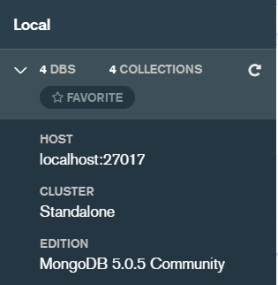

 

## 3. Accéder aux bases de données du serveur 
 

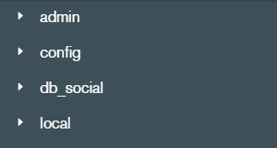

 

## 4. Accéder aux collections 
 

Cliquer sur la petite flèche à gauche de la base de données

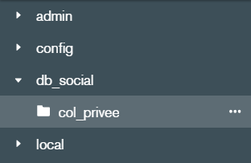

 

## 5. Changer la visualisation des documents 
 

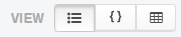

Textuelle  (gauche)

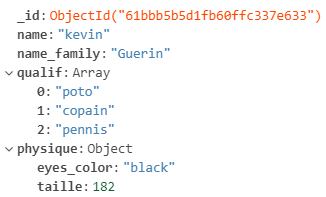

JSON (milieu)

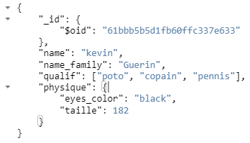

Table (droite)

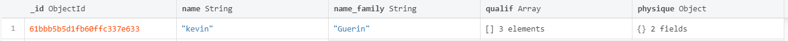
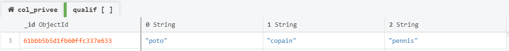
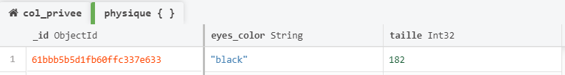

 

## 6. Modifier un document 
 

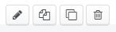

 

- Modifier le contenu du document
- Dupliquer le document
- Cloner le document
- Supprimer le document

 

## 7. Ajouter un document 
 

Cliquer sur le bouton suivant

Cliquer sur le choix proposé

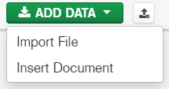

- Un document vierge
- Importer un fichier

 

### 7.1 Importer un fichier 
 

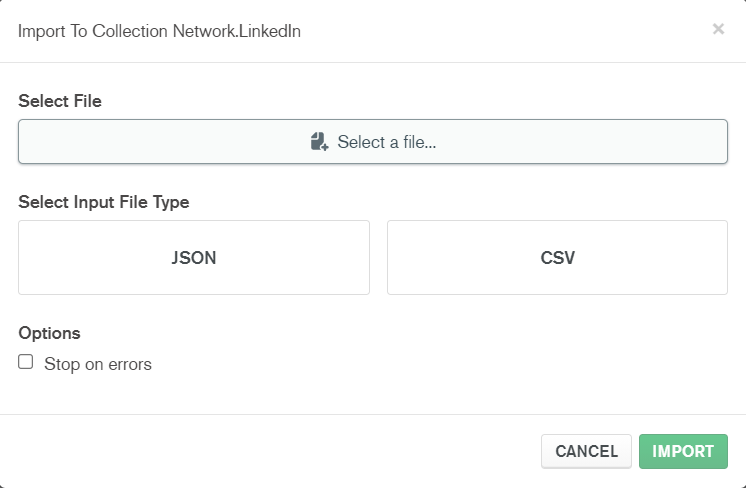

 