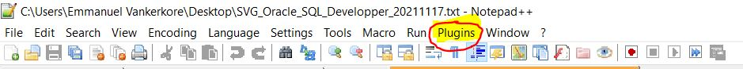
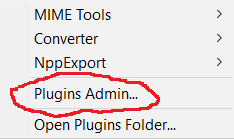
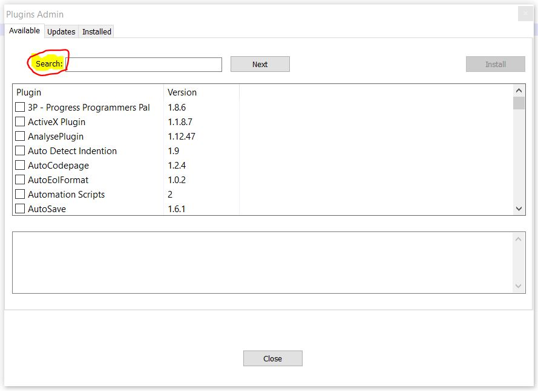
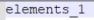
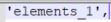
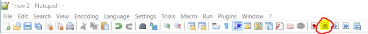
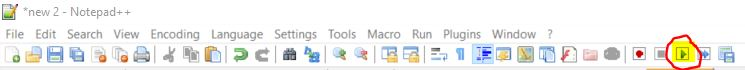
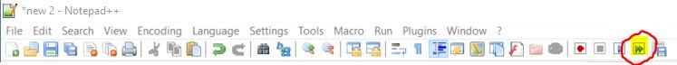
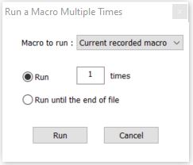
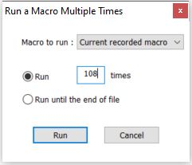

# Tuto avancé sur l'utilisation de Notepadd ++

## 1. Installer des plugs-in
 

étape 1: Cliquer sur "Plugins"

étape 2: Cliquer sur "Plugins Admin"

étape 3: Entrer dans la barre de recherche "Search" l'objet de votre recherche, exemple : XML, JSON, ...

## 2. Enregistrer une macro
 

Exemple de macro :

passer de  :

à 

pour chacune des lignes

étape 1 : Placer votre curseur au tout début de votre document

étape 2 : Cliquer sur le bouton pour démarer l'enregistrement d'une macro

étape 3 : Executer l'ensemble des actions pour une seule ligne

Dans notre cas: {Début} , "'" , {Fin} , "'," , {Fléche du bas}

étape 4 : Cliquer sur le bouton mettre fin à l'enregistrement de la macro

## 3. Utiliser une macro (historiquement la plus récente)
 

### 3.1 Executer une seule fois la macro

### 3.2 Executer plus d'une fois la macro

une nouvelle fenêtre est apparu

Sélectionner la première option pour préciser le nombre de fois que l'on veut exécuter la macro

Sélectionner la seconde option pour exécuter la macro jusqu'à atteindre la fin du fichier

Cliquer sur "Run"

## 4. Prolonger verticalement un curseur
 

Maintenir ( CTRL + SHIFT ) et appuyer sur fléche du haut ou fléche du bas  