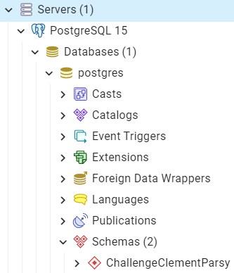
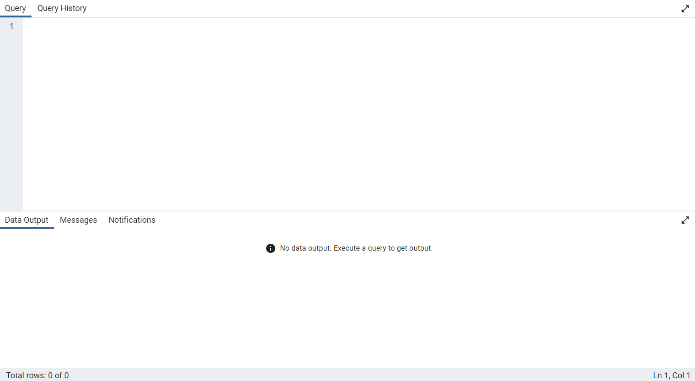
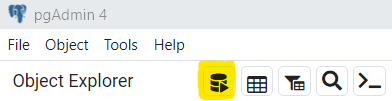
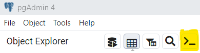
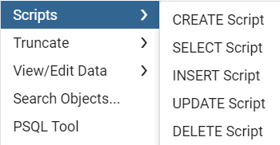

<head>

</head>

# Postgre SQL - interface graphique

## 
0. Comment retrouver l'executable

Il ne faut pas rechercher l'exression "postgre" mais plutôt l'expression "pgAdmin"

## 
1. Présentation globale de l'interface graphique

## 
1.1 Object Explorer
 

On retrouve les éléments principaux éléments constitutif des bases de données SQL:

* Base de données
* Schéma
* Table
* Colonne
* index

## 
1.2 Partie principale

On retrouvera la partie edition des requêtes SQL (en haut) et la partie résultat/message (en bas).

## 
2. Ouvrir l'outil de requêtage SQL

## 
3. Ouvrir un shell propre à Postgre SQL

## 
4. Récupération des requêtes SQL (CRUD)

Faire un clique droit sur une table

