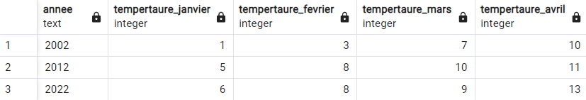

<head>
<style>
#titleMain {color:#808080; font-size:40px; font-weight:bold; font-family:"Cambria"}
#titleSub {color:#677179; font-size:30px; font-weight:bold; font-family: "Verdana"; margin-top:30px; margin-bottom:15px}
#titleSub2 {color:#563C5C; font-size:20px; font-weight:bold; margin-bottom:20px}
#not {color:#1E90FF; font-size:18px "Carnivalee Freakshow"}
#com {color:#FF00FF; font-size:18px "Carnivalee Freakshow"}
#par {color:#32CD32; font-size:18px "Carnivalee Freakshow"}
#val {color:#87CEFA; font-size:18px "Carnivalee Freakshow"}
</style>
</head>

# <div id="titleMain">Requête SQL sur Postgre SQL</div>

## <div id="titleSub">0. Syntaxe</div>

| typologie | encadrement |
| --------- | ----------- |
| texte_explicite | '' |
| base de données, tables et champs | "" |

## <div id="titleSub">1. CRUD</div>

## <div id="titleSub2">1.1 Insertion</div>

<span id="com">INSERT INTO </span>
<span id="val">nom_database.nom_table </span>
<span id="com">( </span>
<span id="val">liste_noms_colonnes </span>
<span id="com">) </span><br>
<span id="com">VALUES </span>
<br><br>

<u>Exemple :</u>

```sql
INSERT INTO "ChallengeClementParsy"."Event" ("EventID", "EventName")
VALUES 
    ('0001', 'Ajouter au panier'),
    ('0003', 'Afficher les détails'),
	('0004', 'Augmenter la quantité'),
	('0006', 'Diminuer la quantité'),
	('0007', 'Choisir la couleur')
    ;
```

## <div id="titleSub2">1.2 Mise à jour</div>

<span id="com">UPDATE </span>
<span id="val">nom_database.nom_table </span><br>
<span id="com">SET </span>
<span id="val">expression </span><br>
<span id="com">WHERE </span>
<span id="val">condition </span>
<br><br>

<u>Exemple :</u>

```sql
update "ChallengeClementParsy"."Event"
set "Product" = 'Fraise du Mont Blanc'
where "EventID" = '0001'
```

## <div id="titleSub">2. Case When</div>

Création d'un nouveau champ à partir de l'observation des valeurs des autres champs
<br><br>

<u>Exemple :</u>

```sql
Case
    when "EventName" = 'Rechercher'
        then "EventID"
    else
        "0000"
end as "occurence_recherche",
```

## <div id="titleSub">3. Récupération d'une valeur sur une autre ligne précédente</div>

Ne peut pas être contenu dans un "where"

## <div id="titleSub2">3.1 une ligne précédente</div>

<span id="com">LEAD ( </span>
<span id="val">nom_colonne </span>
<span id="com">, </span>
<span id="val">offset </span>
<span id="com">) over ( order by</span>
<span id="val">nom_colonne_à_trier </span>
<span id="com">) </span>
<br><br>

<u>Exemple :</u>

```sql
lag("EventName", 2) over (order by "EventID")
```

## <div id="titleSub2">3.1 une ligne suivante</div>

<span id="com">LAG ( </span>
<span id="val">nom_colonne </span>
<span id="com">, </span>
<span id="val">offset </span>
<span id="com">) over ( order by</span>
<span id="val">nom_colonne_à_trier </span>
<span id="com">) </span>
<br><br>

<u>Exemple :</u>

```sql
lag("EventName", 2) over (order by "EventID")
```

pour rappel: offset correspond à un nombre de lignes

## <div id="titleSub">4. Pivot</div>

Le principe du pivot est le fait d'exposer les données en ligne à partir du moment où elle sont exposées en colonne.

<span id="com">SELECT </span>
<span id="val">* </span><br>
<span id="com">FROM crosstab ( </span><br>
<span id="val">requête_SQL </span><br>
<span id="com">) </span><br>
<span id="com">AS </span>
<span id="val">alias_table </span>
<span id="com">( </span>
<span id="val">nomVariable_1 datatype_1, nomVariable_2 datatype_2, ... , nomVariable_n datatype_n </span>
<span id="com">) </span>
<br><br>

<u>Précision :</u>

<span id="not">La paramètre </span> `requête_SQL`
<span id="not">doit contenir exactement 3 champs : </span>

* colonne d'agregation
* colonne à pivoter
* valeurs attachées
<br><br>

<u>Exemple :</u>

```sql
SELECT *
FROM crosstab (
'
select ''2002'' as annee,  ''1'' as mois, 1 as temperature union all
select ''2002'' as annee,  ''2'' as mois, 3 as temperature union all
select ''2002'' as annee,  ''3'' as mois, 7 as temperature union all
select ''2002'' as annee,  ''4'' as mois, 10 as temperature union all
select ''2012'' as annee,  ''1'' as mois, 5 as temperature union all
select ''2012'' as annee,  ''2'' as mois, 8 as temperature union all
select ''2012'' as annee,  ''3'' as mois, 10 as temperature union all
select ''2012'' as annee,  ''4'' as mois, 11 as temperature union all
select ''2022'' as annee,  ''1'' as mois, 6 as temperature union all
select ''2022'' as annee,  ''2'' as mois, 8 as temperature union all
select ''2022'' as annee,  ''3'' as mois, 9 as temperature union all
select ''2022'' as annee,  ''4'' as mois, 13 as temperature
'
)
AS alias_table (Annee text,
				tempertaure_Janvier integer, 
				tempertaure_Fevrier integer,
				tempertaure_Mars integer,
				tempertaure_Avril integer )
```
<br><br>

<u>Visualisation des données avant un pivot :</u>


<br><br>

<u>Visualisation des données après un pivot :</u>



## <div id="titleSub">5. Création de données à la volée</div>

<span id="com">SELECT </span>
<span id="val">valeur_11 </span>
<span id="com">AS </span>
<span id="val">nomChamps_1</span>
<span id="com">, </span>
<span id="val">valeur_12 </span>
<span id="com">AS </span>
<span id="val">nomChamps_2</span>
<span id="com">, </span>
...
<span id="com"> , </span>
<span id="val">valeur_1n </span>
<span id="com">AS </span>
<span id="val">nomChamps_n</span>
<span id="com">UNION ALL </span><br>

<span id="com">SELECT </span>
<span id="val">valeur_21 </span>
<span id="com">AS </span>
<span id="val">nomChamps_1</span>
<span id="com">, </span>
<span id="val">valeur_22 </span>
<span id="com">AS </span>
<span id="val">nomChamps_2</span>
<span id="com">, </span>
...
<span id="com"> , </span>
<span id="val">valeur_2n </span>
<span id="com">AS </span>
<span id="val">nomChamps_n</span>
<span id="com">UNION ALL </span><br>
...<br>
<span id="com">SELECT </span>
<span id="val">valeur_m1 </span>
<span id="com">AS </span>
<span id="val">nomChamps_1</span>
<span id="com">, </span>
<span id="val">valeur_m2 </span>
<span id="com">AS </span>
<span id="val">nomChamps_2</span>
<span id="com">, </span>
...
<span id="com"> , </span>
<span id="val">valeur_mn </span>
<span id="com">AS </span>
<span id="val">nomChamps_n</span>

## <div id="titleSub">6. Stocker les données dans une table temporaire</div>

<span id="com">WITH </span>
<span id="val">nom_table_temporaire_1 </span>
<span id="com">AS ( </span><br>
<span id="val">requête_1 </span><br>
<span id="com">), </span>
<span id="val">nom_table_temporaire_2 </span>
<span id="com">AS ( </span><br>
<span id="val">requête_2 </span><br>
<span id="com">) </span><br>
<span id="val">requête_3 </span>
<br><br>

La table_2 peut être construite à partir des données de la table_1.<br>
La table_3 peut être construite à partir des données des table_1 et table_2.

## <div id="titleSub">7. Appeler l'exécution d'une procédure</div>

<span id="com">CALL </span>
<span id="val">nom_base_de_données </span>
<span id="val">nom_produre</span>
<span id="com">( ) </span><br>

## <div id="titleSub">8. AUnifier des données </div>

## <div id="titleSub2">8.1 Tenir compte des enregistrements en doublon entre les deux tables</div>

<span id="com">Select </span>
<span id="val">* </span><br>
<span id="com">From </span>
<span id="val">table_1 </span><br>

<span id="com">Union </span>

<span id="com">Select </span>
<span id="val">* </span><br>
<span id="com">From </span>
<span id="val">table_1 </span><br>

## <div id="titleSub2">8.2 Ne pas tenir compte des enregistrements en doublon entre les deux tables</div>

<span id="com">Select </span>
<span id="val">* </span><br>
<span id="com">From </span>
<span id="val">table_1 </span><br>

<span id="com">Union all</span>

<span id="com">Select </span>
<span id="val">* </span><br>
<span id="com">From </span>
<span id="val">table_1 </span><br>


## <div id="titleSub">99. Problèmes</div>

## <div id="titleSub2">La fonction crosstab n'existe pas</div>

Si le lien existe toujours --> https://stackoverflow.com/questions/55230282/function-crosstabunknown-unknown-does-not-exist-but-it-does

Sinon suivre la procédure ci-dessous:<br>
- Ouvrir un shell Postgre SQL
- Entrer la commande suivante : \dx
- Entrer la commande suivante : CREATE EXTENSION tablefunc;
- Entrer la commande suivante : \dx
  
Après la saisie de la première commande, on ne voit pas l'extension "tablefunc".<br>
Après la saisie de la troisième commande, maintenant on constate à l'apparition "tablefunc".