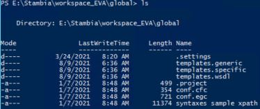

<head>
<style>
#bleu {}
#titleMain {color:#808080; font:28px ;font-weight:bold}
#titleSub {}
#titleSubSub {}
#commande {color:#FF00FF; font:16px "Carnivalee Freakshow"}
#tag {color:#87CEFA; font:16px "Carnivalee Freakshow"}
#param {color:#32CD32; font:16px "Carnivalee Freakshow"}
</style>
</head>


<!-- ```css
<head>
<style>
#bleu {
color:#87CEFA }
</style>
</head>
``` -->

# <span id="titleMain">Tuto sur les fondamentaux Stambia</span>

- [<span id="titleMain">Tuto sur les fondamentaux Stambia</span>](#tuto-sur-les-fondamentaux-stambia)
  - [1. Rechercher le dossier contenant le fichier à partir de son nom](#1-rechercher-le-dossier-contenant-le-fichier-à-partir-de-son-nom)
  - [1.1 Path](#11-path)
  - [1.2 Name](#12-name)
  - [1.3 Recurse](#13-recurse)
  - [2. Remonter dans le repertoire parent](#2-remonter-dans-le-repertoire-parent)
  - [3. Descendre dans un repertoire enfant](#3-descendre-dans-un-repertoire-enfant)
  - [4. Lister l'ensemble des items du repertoire en cours](#4-lister-lensemble-des-items-du-repertoire-en-cours)
  - [5. Lister l'ensemble des items en fonction de la date de création](#5-lister-lensemble-des-items-en-fonction-de-la-date-de-création)
  - [6. Lister l'ensemble des items en fonction de l'extension de fichier recherché](#6-lister-lensemble-des-items-en-fonction-de-lextension-de-fichier-recherché)


## 1. Rechercher le dossier contenant le fichier à partir de son nom
<br>

<span id="commande">Get-ChildItem </span><span id="tag">-Recurse -Path</span><span id="param"> "E:/" </span><span id="tag">-Name</span> <span id="param">"*GDM_ECOM_CMD_"</span>

## 1.1 Path
<br>

Préciser l'emplacement raçine de la recherche.

## 1.2 Name
<br>

Préciser le nom du fichier à rechercher.<br>
Rappel: "*" symbolise une quantité allant de 0 à +∞ caractères

## 1.3 Recurse
<br>

Activer l'option de recherche dans tous les sous-dossiers

## 2. Remonter dans le repertoire parent
<br>

<span id="commande">cd ..</span>

## 3. Descendre dans un repertoire enfant
<br>

<span id="commande">cd</span> <span id="param">"nom du dossier enfant"</span>

## 4. Lister l'ensemble des items du repertoire en cours
<br>

<span id="commande">ls</span>



## 5. Lister l'ensemble des items en fonction de la date de création

<span id="commande"> Get-ChildItem </span><span id="tag"> -Recurse -Path </span><span id="param">"C:\Users\Emmanuel Vankerkore\Documents\Activités journalières\détails"</span> | where {$_.CreationTime <span id="tag">-match </span><span id="param">"(08/19/2021)"</span>}

## 6. Lister l'ensemble des items en fonction de l'extension de fichier recherché

<span id="commande"> Get-ChildItem </span><span id="tag"> -Recurse -Filter <span id="param">"*.sql"</span> -Path </span><span id="param">"C:\Users\Emmanuel Vankerkore\Documents"</span>


mkdir


dir