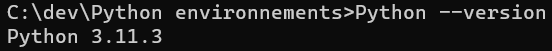
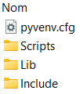
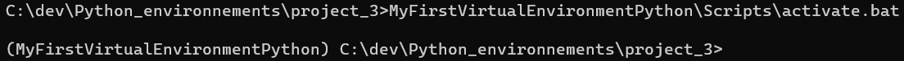
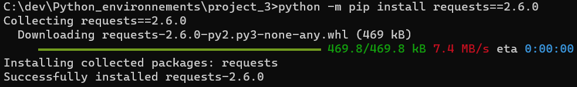
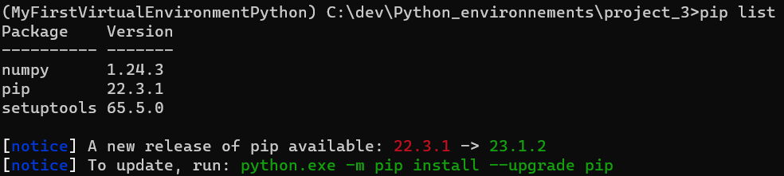

<head>
<style>
#titleMain {color:#808080; font-size:40px; font-weight:bold; font-family:"Cambria"}
#titleSub {color:#677179; font-size:30px; font-weight:bold; font-family: "Verdana"; margin-top:30px; margin-bottom:15px}
#titleSub2 {color:#563C5C; font-size:20px; font-weight:bold; margin-bottom:20px}
#not {color:#1E90FF; font-size:18px "Carnivalee Freakshow"}
#com {color:#FF00FF; font-size:18px "Carnivalee Freakshow"}
#par {color:#32CD32; font-size:18px "Carnivalee Freakshow"}
#val {color:#87CEFA; font-size:18px "Carnivalee Freakshow"}
</style>
</head>

<!-- ```css
<head>
<style>
#bleu {
color:#87CEFA }
</style>
</head>
``` -->

# <div id="titleMain">Travailler sur environnement virtuel avec Python</div>

## <div id="titleSub">0. Vérifier que Python est disponible </div>

Identifier le dossier dans lequel se trouve le fichier Python.exe et pip.exe<br>
Définir le dossier dans la variable Path dans le gestionnaire des variables d'environnement<br>

<span id="com">python </span>
<span id="par">--version </span>




## <div id="titleSub">1. Création d'un dossier qui sera notre environnement virtuel</div>

<span id="com">python </span>
<span id="par">-m venv </span>
<span id="val"><nom_du_dossier> </span>

Si la commande a réussie alors l'arborescence dans le dossier apparaît:



<span id="not">Attention: les antis virus peuvent bloquer l'installer de certains scrits, le mieux est de les désactiver.</span>

## <div id="titleSub">2. Activer l'environnement virtuel</div>

il faut simplement exécuter la ligne de commande suivantes depuis le dossier contenant l'environnement virtuel

<span id="val"> <nom_du_dossier>\Scripts\activate.bat</span>



## <div id="titleSub">3. Désactiver l'environnement virtuel</div>

<span id="com">deactivate </span>
<span id="val">nom_du_dossier </span>

## <div id="titleSub">4. Installer une version précise d'un package</div>

Si l'on n'est pas dans l'environnement virtuel, il faut précéder la commande de "python -m".

<span id="com">python</span>
<span id="par">-m </span>
<span id="com">pip </span>
<span id="par">install </span>
<span id="val">nom_du_package==version</span>

pour rappel: exemple de version 1.5.4



## <div id="titleSub">5. Installer la dernière version d'un package</div>

<span id="com">python</span>
<span id="par">-m </span>
<span id="com">pip </span>
<span id="par">--upgrade install </span>
<span id="val">nom_du_package</span>

## <div id="titleSub">6. Désinstaller un package</div>

<span id="com">python</span>
<span id="par">-m </span>
<span id="com">pip </span>
<span id="par">uninstall </span>
<span id="val">nom_du_package</span>

## <div id="titleSub">7. Consulter la liste des package</div>

<span id="com">pip </span>
<span id="par">list </span>



## <div id="titleSub">8. Figer la version des packages</div>

<span id="com">python</span>
<span id="par">-m </span>
<span id="com">pip </span>
<span id="par">freeze > requirements.txt </span>

## <div id="titleSub">9. Réaliser une installation à partir du requierements.txt</div>

<span id="com">pip install</span>
<span id="par">-r </span>
<span id="par">requirements.txt </span>