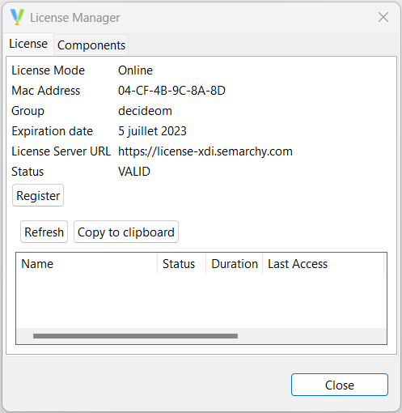

<head>
<style>
#titleMain {color:#808080; font-size:40px; font-weight:bold; font-family:"Cambria"}
#titleSub {color:#677179; font-size:30px; font-weight:bold; font-family: "Verdana"; margin-top:30px; margin-bottom:25px}
#titleSub2 {color:#563C5C; font-size:20px; font-weight:bold; margin-bottom:20px}
#titleSubSub {}
#com {color:#FF00FF; font-size:18px "Carnivalee Freakshow"}
#par {color:#32CD32; font-size:18px "Carnivalee Freakshow"}
#val {color:#87CEFA; font-size:18px "Carnivalee Freakshow"}
#imp {color:#e21313; font:bold 20px "Carnivalee Freakshow"}
#def {color:#90EE90; font-size:18px "Carnivalee Freakshow"}
#not {color:#1E90FF; font-size:18px "Carnivalee Freakshow"}
#att {color:#ffa500; font-size:18px "Carnivalee Freakshow"}
.video-responsive {
 overflow:hidden;
 padding-bottom:56.25%; 
 position:relative;
 height:0;
}
.video-responsive iframe {
 left:0;
 top:0;
 height:100%;
 width:100%;
 position:absolute;
}
</style>
</head>

# <span id="titleMain">Installer Semarchy xDI</span>

Par Stambia, j'entends "Designer", "Runtime" et "Analytics".

## <span id="titleSub">0. Architecture de Semarchy xDI</span>
<br>

## <span id="titleSub2">0.1 Les composants</span> 

L' <span id="imp">architecture</span> de Semarchy xDI comprend les 3 composants suivants:
	
- Le <u>**Runtime**</u> est un processus Java léger qui exécute les flux d'intégration. Il se connecte aux systèmes et applications contenant les données à intégrer.
- Le <u>**Designer**</u> est un client lourd basé sur la plateforme Eclipse, utilisé par les concepteurs d'intégration pour concevoir leurs flux d'intégration.
- <u>**Production Analytics**</u> est une application Java EE qui fournit une interface Web utilisée en production pour déployer, gérer et surveiller les flux d'intégration.
<br>


## <span id="titleSub2">0.1 Les exigences</span>

* Designer<br>
  - OS : {Windows [7, 8.1, 10] <64-bits> ; Linux <64-bits>}
  - Java : version 11 (LTS)
  - RAM : au moins 8 Go
* Runtime<br>
  - Java : version 11 (LTS)
* Analytics<br>
  - Apache Tomcat : version [8.5.x , 9.0.x]
  - Java : version 11 (LTS)
  - Browser : {Google Chrome 68,
					    Firefox 61, 
					    Microsoft Edge 42,
					    Safari 11}

## <div id="titleSub">1. installer Designer</div>

1. Utiliser le lien suivant: https://www.semarchy.com/all-downloads/
2. Décomprésser le dossier dans un dossier approprié ( C:\Program Files )
3. C'est bon, c'est installé

## <div id="titleSub2">1.1. Lancer Stambia (Semarchy Designer)</div>

Pour lancer Stambia, réaliser un clique droit sur semarchy-xdi-designer-windows.exe
		en tant qu'administrateur


<span id="not">Si l'on a une licence alors ignorer l'essai gratuit.<br>

## <div id="titleSub2">1.2 Activer la licence</div>

1. Cliquer sur Help
2. Cliquer sur Manage License
3. Cliquer sur Register


4. Sélectionner Semarchy License Server
5. Entrer la clé et la licence est activée



## <div id="titleSub">2 Runtime</div> 

## <div id="titleSub2">2.0 Installer le runtime</div>

1. Décompresser et déplacer le fichier zip
2. Vérifier et initialiser si besoin la permission à l'exécution des fichiers .bat (pour Windows) localisé dans le répertoire raçine
3. Vérifier et initialiser si besoin la permission en ecriture des dossiers suivants : ./temp ./build ./sessions

https://www.semarchy.com/download-archives/

## <div id="titleSub2">2.1 Configurer le runtime</div>

Il y 3 façons de configurer le runtime:

- via les variables d'environnement
- à l'aide du fichier de configuration du runtime
- à l'aide du fichier de configuration du planificateur (scheduler)

Par défaut, les deux fichiers de configuration sont dans le dossier ./runtiume/properties et sont nommés ainsi:

- engineParameter.xml
- engineScheduler.properties

<span id="not">Pour faciliter les montées de version du runtime, il est recommandé de copier le dossier "properties".
</span><br>

Le runtime reconnait 5 variables d'environnement:

- JAVA_HOME
- XDI_RUNTIME_PROPERTIES_LOCATION
- XDI_RUNTIME_INIT_MEMORY
- XDI_RUNTIME_MAX_MEMORY
- XDI_RUNTIME_STACK_SIZE

Il existe une syntaxe pour définir un paramètre et sa valeur à l'aide d'une variable d'environnement:

<span id="com">${environment.variable: </span>
<span id="val">ENV_VARIABLE_NAME </span>
<span id="com">: </span>
<span id="val">default_value </span>
<span id="com">} </span>

Exemple d'utilisation :

```xml
<parameter
  name="launchSchedulerEngine"
  value="${environment.variable:XDI_DESIGNER_SCHEDULER_ENABLE:true}"
/>
```

La syntaxe ci-dessus signifie que l'on déclare un paramétre "launchSchedulerEngine" avec pour valeur celle de la variable d'environnement XDI_DESIGNER_SCHEDULER_ENABLE. Et si la variable d'environnement XDI_DESIGNER_SCHEDULER_ENABLE n'est pas initialisé alors launchSchedulerEngine est définit à true.

Avec le fichier de configuration "engineParameters.xml", on peut configurer tous ces éléments:
		
- Les services
- La sécurité
- Le dépôt (Repositorie)
- Le srockage de la journalisation
- Des options additionnelles de Java

Exemple de définition de repository : 

```xml
<repositories>
  <deliveryRepository name="default" class="com.semarchy.xdi.runtime.repository.delivery.FileDeliveryRepositoryPlugin" default="true">
    <parameter name="folder" value="build/deliveries/default/"/>
  </deliveryRepository>
  
  <deliveryRepository name="webservices" class="com.semarchy.xdi.runtime.repository.delivery.FileDeliveryRepositoryPlugin" default="true" webservice="true">
    <parameter name="folder" value="build/deliveries/webservices/"/>
  </deliveryRepository>
</repositories>	
```

<span id="not">Pour rappel: le répertoire en cours est le dossier "runtime".</span><br>

Pour ce qui est de la thématique de la sécurité, 4 rôles sont définits:

- Connect
- View
- Execute
- Admin

<span id="not">L'utilisation de "Connect" est obligatoire pour définir le rôle d'un utilisateur.</span><br>

Exemple de définition d'utilisateur avec rôle

```xml
<security>
   <...>
   <user name="user01"  password="xxxxxx" uncryptedPassword="password" roles="Connect View Execute"/>
   <user name="user02"  password="xxxxxx" uncryptedPassword="password" roles="Connect View Execute"/>
   <...>
</security>
```

<span id="not">On renseigne soit password soit uncryptedPassword mais pas les deux.</span><br>

Le fichier "engineParameter.xml" se trouve dans le dossier "\runtime\properties".

Pour associer une base de données au runtime, il faut (tout se fait dans le fichier engineParameter.xml):

1. Commenter ou supprimer l'ancienne
2. On enlève les commentaires pour Postgre SQL par exempl
3. On remplace par les valeurs en dur les éléments de type [xxxx]
4. Exemple :

```xml
<!--
==============================
PostgreSQL Log Database
==============================
-->
<logs>
  <log userLogName="logDatabase" autoUpdate="true" userLogClass="com.semarchy.xdi.runtime.sessionlog.RdbmsLogger">
    <parameter name="userLogRdbmsDriver" value="org.postgresql.Driver"/>
    <parameter name="userLogRdbmsUrl" value="jdbc:postgresql://localhost:5432/certif_xDI_analytics"/>
    <parameter name="userLogRdbmsUser" value="postgres"/>
    <parameter name="userLogRdbmsPassword" value=""/>
    <parameter name="userLogRdbmsModule" value="default"/>
    <parameter name="userLogRdbmsSchemaName" value="runtime"/>
    <parameter name="userLogRdbmsVarcharType" value="varchar"/>
```

5. On relance le runtime
6. On constate que les tables on était automatiquement créées


C'est bon le runtime est configuré !

Pour configurer, le scheduler du runtime:

1. Récupérer le code SQL mis à disposition dans le dossier /scripts/scheduler
2. Pour Postgres SQL, il faut préciser nom du schéma avant le nom des tables
3. Copier le fichier "engineScheduler.properties" depuis le dossier /properties/samples/schedules/common dans le dossier /properties

## <div id="titleSub2">2.2 Lancer le runtime</div>

Dans le dossier "bin", lancer l'exécution du fichier "startengine.bat"

## <div id="titleSub2">2.1 Lancer le runtime depuis xDI Designer</div>

1. Ouvrir le gestionnaire d'environnements


2. Lancer le runtime


Normalement, une fenêtre de type "invit de commande" est apparue.<br>
<span id="att"> Ne pas fermer cette application! </span><br>
Elle ressemble à ceci:


## <div id="titleSub">3 Semarchy Production Analytics</div>

## <div id="titleSub2">3.1 Télécharger</div>

* Une base de données (MariaDB) via le lien suivant :<br>
https://mariadb.org/download/?t=mariadb&p=mariadb&r=10.7.3&os=windows&cpu=x86_64&pkg=zip&m=tripleit

* Une plateforme Java (Open JDK) via le lien suivant :<br>
https://adoptium.net/releases.html?variant=openjdk11

* Un service web (Tomcat) via le lien suivant :<br>
https://tomcat.apache.org/download-90.cgi

* Une plateforme web (Analytics) via le lien suivant :<br>
https://www.semarchy.com/download-archives/

## <div id="titleSub2">3.2 Installer</div>

1. Décomprésser et placer le dossier dans le répertoire raçine de Semarchy xDI Designer
2. Dans le répertoire raçine de Semarchy xDI Designer, il y a un fichier
		"semarchy-xdi-designer-windows.ini"
3. Ouvrir ce fichier en mode édition
4. Ajouter au début les DEUX lignes suivantes

```ini
- vm
jdk-11/bin
```

<span id="not">jdk-11 est le nom du dossier correspondant au répertoire raçine de OpenJDK.
</span><br>

5. Décompresser le .zip correspondant au téléchargement de Tomcat
6. Placer le dossier dans un dossier approprié ( C:\Program Files )
7. Placer une seconde fois de dossier décompressé de OpenJDK pour le placer dans le répertoire raçine de Tomcat
8. Créer un nouveau fichier "setenv.bat" avec le contenu suivant

```bat
set "JAVA_HOME=%CATALINA_BASE%\jdk-11"
exit /b 0
```

9. Lancer l'exécution du fichier "startup.bat". cela va installer et configurer un serveur Tomcat

Afin de s'assurer que le serveur est correctement actif, on peut ouvrir le lien suivant via n'importe quel navigateur internet : http://localhost:8080

<span id="not">Vous pouvez observer que le nom de l'invite de commandes	est "Tomcat"
</span><br>

Afin de fermer correctement le serveur Tomcat, on exécute le fichier "shutdown.bat"

10. Suivre les instructions du lien suivant: https://www.manejandodatos.es/2020/11/mariadb-10-4-portable-en-tu-usb-2/
11. Configurer MariaDB

Décompresser le .zip

Placer le dossier dans un dossier approprié ( C:\Program Files )

Ouvrir une invit de commande et se placer sur dossier bin

Lancer la commande "mysqld --console"

Normalement ça ne fonctionne pas mais c'est normal

Lancer l'exécution de la commande "mysql_install_db"

La base de données a été créé

Créer un nouveau fichier "my.ini" avec le contenu suivant (emplacement à confirmer)

```ini
[client]
port=3306
socket=C:/Program Files/MariaDB-11/tmp/mysql.sock

[mysql]
default-character-set=utf8

[mysqld]
port=3306
socket=/tmp/mysql.sock
key_buffer_size=16M
max_allowed_package=100M
basedir="C:/Program Files/MariaDB-11"
datadir="C:/Program Files/MariaDB-11/data2"
```

0. Se rendre sur postgre SQL
1. Lancer le code SQL suivant :

```sql
CREATE SCHEMA extensions;
GRANT USAGE ON SCHEMA extensions TO PUBLIC;
ALTER DEFAULT PRIVILEGES IN SCHEMA extensions GRANT EXECUTE ON FUNCTIONS TO PUBLIC;
ALTER DATABASE "certif_xDI_analytics" SET SEARCH_PATH TO "$user",public,extensions;

/* Create the user and schema */

CREATE USER eva_admin WITH PASSWORD 'admin';
CREATE SCHEMA analytics AUTHORIZATION eva_admin;
```

3. stocker précieusement les informations suivantes :

<analytics_db_user> --> eva_admin
<analytics_db_password> --> admin

4. Initialiser la variable d'environnement "XDI_ANALYTICS_WEBAPP_HOME", cette variable contiendra le chemin d'un dossier qui contiendra:

- fichiers de configuration
- données temporarires (logs)
- drivers

5. Identifier si la variable existe, ouvrir un terminal et entrer la commande "set"

Normalement la variable XDI_ANALYTICS_WEBAPP_HOME n'existe pas

6. Dans ce même terminal, pour Windows, entrer la commande suivante

set XDI_ANALYTICS_WEBAPP_HOME=C:/analytics/

Et normalement, la variable existe (vérifier avec la commande set)

7. Lorsque l'on lance Tomcat en tant que service sur Windows, il est recommandé d'initialiser la configuration de commencement en utilisant les variables d'environnements

Installer Tomcat 
Ouvrir une invit de commande, se placer sur le dossier "C:\Program Files\apache-tomcat-10.1.9\bin\"
installer un service avec la commande suivante : "tomcat10 //IS"
Démarrer le service (afin d'identifier le nom par défaut) avec la commande suivante : "tomcat10 //ES"
Stopper le service avec la commande suivante : "tomcat10 //SS"
Mettre à jour le service avec la commande suivante : "tomcat10 //US//tomcat10 ++Environment XDI_ANALYTICS_WEBAPP_HOME=C:/analytics/"

Le service est visible dans la section "Services" dans le gestionnaire de tâches (pour rappel Ctrl + Alt + Suppr)

8. Installer le Driver de la base de données dans Tomcat

Il faut simplement ajouter dans le dossier <tomcat>/lib le fichier correspondant au driver de la base de données

9. Configurer l'accès à la base de données 

Dans le dossier <tomcat>\conf\ , ouvrir en mode édition le fichier "context.xml"
Introduire la partie ci-dessous dans le noeud "Context"

```xml
<Resource name="jdbc/sta_datasource_tomcat"  
    auth="Container" type="javax.sql.DataSource"
    driverClassName="com.mysql.jdbc.Driver" 
    url="jdbc:mysql://localhost:3306/documentation" 
    username="<analytics_db_user>" 
    password="<analytics_db_password>" 
    maxTotal="100" 
    maxIdle="30" 
    maxWaitMillis="10000" 
/>
```

10. Configurer les accès des utilisateurs à Analytics

Dans le dossier <tomcat>\conf\ , ouvrir en mode édition le fichier "tomcat-users.xml"
Introduire la partie ci-dessous dans le noeud "tomcat-users"

```xml
	<tomcat-users>
	  <user
		name="root"
		password="root"
		roles="admin-gui, manager-gui, analyticsAdmin, analyticsConnect" 
	  />
	</tomcat-users>
```

11. Déployer analytics sur Tomcat

Pour déployer analytics, il faut simplement déposer dans le dossier <tomcat>/webapp, le fichier "semarchy-xdi-analytics.war" et Tomcat va automatiquement le déployer

12. Entrer l'URL suivante dans n'importe quel navigateur internet

http://localhost:8080/semarchy-xdi-analytics/semarchy

13. Pour se connecter aux runtimes, il faut intégrer les drivers relatifs à la connexion aux logs du runtime et du scheduler