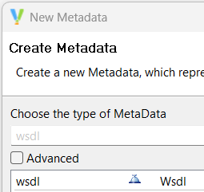
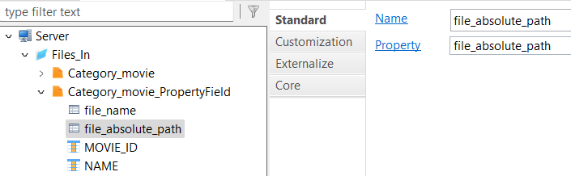
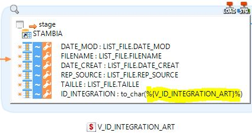

<head>
<style>
#boiteimagetexte {display:flex; align-items: flex-start}
#titleMain {color:#808080; font-size:40px; font-weight:bold; font-family:"Cambria"}
#titleSub {color:#677179; font-size:30px; font-weight:bold; font-family: "Verdana"; margin-top:30px; margin-bottom:25px}
#titleSub2 {color:#563C5C; font-size:20px; font-weight:bold; margin-bottom:20px}
#titleSubSub {}
#com {color:#FF00FF; font-size:18px "Carnivalee Freakshow"}
#par {color:#32CD32; font-size:18px "Carnivalee Freakshow"}
#val {color:#87CEFA; font-size:18px "Carnivalee Freakshow"}
#imp {color:#e21313; font:bold 20px "Carnivalee Freakshow"}
#def {color:#90EE90; font-size:18px "Carnivalee Freakshow"}
#not {color:#1E90FF; font-size:18px "Carnivalee Freakshow"}
#att {color:#ffa500; font-size:18px "Carnivalee Freakshow"}
</style>
</head>

# <div id="titleMain">Designer</div>

## <div id="titleSub">0. Architecture</div>

L'arborescence pour du dossier "001_Server" pour un base de données SQL:<br><br>

<span STYLE="padding:0 0 0 20px;">  --> Dossier</span><br>
<span STYLE="padding:0 0 0 40px;">  --> MetaData</span><br>
<span STYLE="padding:0 0 0 60px;">  --> Assistant</span><br>
<span STYLE="padding:0 0 0 80px;">  --> Configurateur  </span><br>
<span STYLE="padding:0 0 0 80px;">  --> Schema</span><br>

L'arborescence pour du dossier "002_Modele" pour un base de données SQL:<br><br>

<span STYLE="padding:0 0 0 20px;">  --> Dossier </span><br>
<span STYLE="padding:0 0 0 40px;">  --> MetaData </span><br>
<span STYLE="padding:0 0 0 60px;">  --> Raccourci schema </span><br>
<span STYLE="padding:0 0 0 80px;">  --> DataStore </span><br>
<span STYLE="padding:0 0 0 100px;">  --> Colmun </span><br>
<span STYLE="padding:0 0 0 100px;">  --> Primary Key </span><br>
<span STYLE="padding:0 0 0 100px;">  --> Variable </span><br>
<span STYLE="padding:0 0 0 100px;">  --> Fonction </span><br>
<span STYLE="padding:0 0 0 100px;">  --> Filter </span><br>
<span STYLE="padding:0 0 0 100px;">  --> Index </span><br>

## <div id="titleSub">1. Métadata</div>

## <div id="titleSub2">1.1 Web Service</div>

Les anciennes versions de Designer :



Un Web service est constitué des items suivants:<br><br>

<span STYLE="padding:0 0 0 20px;">  --> Web Service</span> <br>
<span STYLE="padding:0 0 0 40px;">  --> Service </span><br>
<span STYLE="padding:0 0 0 60px;">  --> Verb (GET, POST, PATCH, ...)</span><br>
<span STYLE="padding:0 0 0 80px;">  --> Opération </span><br>
<span STYLE="padding:0 0 0 100px;">  --> Sens du flux (in, out, fault) </span><br>
<span STYLE="padding:0 0 0 120px;">  --> Part (élément structurant le sens du flux) </span><br>
<span STYLE="padding:0 0 0 140px;">  --> Liste d'éléments (XML) </span><br>
<span STYLE="padding:0 0 0 140px;">  --> Liste d'éléments (JSON) </span><br>

Les nouvelles versions de Designer :


## <div id="titleSub2">1.2 Ajouter un champ qui indique la valeur du rang pour un élément par rapport à son noeud père dans un fichier XML</div>

1. Assurez-vous que votre élément soit contenu dans une séquence


2. Cliquer droit sur l'élément / New / Property Field


3. Dans les propriétés, entrer un nom pour "Name" et choisisser "nodeLocalPosition" pour "Property"


## <div id="titleSub2">1.3 JSON : La différence entre Array [] et Object {}</div>

Array [] : un ensemble d'élément sans préciser la variable<br>
Object {} : un ensemble d'élément sans préciser la variable

```json
["chat", "chien", "rat", "requin"]

{"animal" : "chat",
  "animal" : "chien",
  "animal" : "rat",
  "animal" : "requin"}
```

## <div id="titleSub2">1.4 Utiliser le "Property field"</div>

> Dans l'ancienne version

La liste des "Property field" est disponible via l'URL suivante : https://stambia.org/doc/132-technology-articles/file/flat-files/246-using-file-property-fields

> Dans les versions plus récentes

La liste des "Property field" est disponible depuis Semarchy mais "Name" doit correpondre à "Property"



On récupère les informations via un mapping


On constate que les valeurs ont bien été récupérées


## <div id="titleSub">2. Mapping</div>

## <div id="titleSub2">2.1 Opération sur les champs</div>


## <div id="titleSub2">2.2 Modifier le type de jointure</div>


## <div id="titleSub2">2.3 Réaliser un distinct</div>

Depuis l'éditeur de Designer

1. sélectionner l'item d'intégration


2. Se rendre dans les propriétés et cocher la case représentée ci-dessous


## <div id="titleSub2">2.4 Insérer un stage</div>

Depuis l'éditeur "Project Explorer"

étape 1: sélectionner un schéma<br>
étape 2: drag and drop dans la partie Designer (dans un espace vide)

alternative

étape 1: sélectionner un schéma<br>
étape 2: drag and drop sur le lien entre le in et le out

## <div id="titleSub2">2.5 Insérer un filtre</div>

Depuis l'éditeur de Designer

étape 1: sélectionner le champ d'une table<br>
étape 2: faites un drag and drop vers un espace vide (voir ci-dessous)


## <div id="titleSub2">2.6 Faire appel à une variable</div>

Depuis la fenêtre "Project Explorer"

1. Drag and Drop la variable dans le process
2. Sélectionner la variable, on recalculer la valeur de la variable dans les propriétés de la façon suivante:


3. utiliser la valeur d'une variable dans un mapping de la façon suivante:



## <div id="titleSub2">2.7 Prioriser l'ordre d'exécution des jointures</div>

1. Sélection une jointure 


2. Se rendre dans l'onglet "Propriété"
3. Sélectionner avec un clique gauche la section "Advanced"


4. Entrer un nombre entier > 0 


## <div id="titleSub">2.8 Générer expression "having" dans un mapping</div>

Conception:


propriété du filtre:


## <div id="titleSub2">2.9 Activer les rejets </div>


ou


## <div id="titleSub2">2.10 Recycler les données</div>

Sélectionner les propriétés d'intégration et cliquer sur "Recycle Rejects"


## <div id="titleSub2">2.11 Ajouter un index dans un stage</div>

1. Se rendre dans les propriétés du template de Staging (STG) et activer l'option "Create Stage Indexes"


2. Se rendre dans les champs concernés par l'index et définir un tag préfixé par "IDX"


## <div id="titleSub2">2.12 Prioriser l'intégration des données d'une table</div>

1. Selectionner la table de sortie
2. Se rendre dans l'onglet "Properties"
3. Se rendre dans la section "Advanced"
4. Entrer une nombre entier positif dans le champ "Integration Sequence"


## <div id="titleSub">3. Process</div>

## <div id="titleSub">4. Palette</div>

## <div id="titleSub2">4.1 SQL To Parameters</div>

1. On drag and drop l'élément "Sql To Parameters"


2. Dans la partie "Expression Editor", il faut entrer sa requête en respectant la structure suivante

(1) Nom du paramètre<br>
(2) Type du paramètre<br>
(3) Requête SQL qui donne la valeur du paramètre<br>


3. On se rend dans l'onglet "Project Explorer" et on drag and drop le schéma dont dépend la requête SQL.


## <div id="titleSub2">4.2 Wait for files</div>

| Paramètre + valeur | Description |
| --- | ----------- |
|  | Quantité de fichiers infini |
|  | Inclure uniquement les fichiers dont l'extension correspond à "BIL", "LIN" ou "LOG". |

Lorsque l'on insère un schéma dans le composant:


<div id="not">Si la table "IND_SESSION_FILE_OP_LST" n'existe pas dans le schéma, alors elle sera automatiquement créé. Cette table contient une grande quantité d'informations relatives aux fichiers identifiés.</div>

## <div id="titleSub">5. Autres fonctionnalités</div>

## <div id="titleSub2">5.1 Identifier dans "Project Explorer" à partir du Designer l'item selectionné</div>

De façon automatique

étape 1: Activer la fonctionnalité en cliquant sur le bouton ci-dessous


De façon manuelle

étape 1: Sélectionner une entité (schéma, base de donnée, table, fichier, ...) depuis le Designer<br>
étape 2: Activer la fonctionnalité en cliquant sur le bouton ci-dessous


## <div id="titleSub2">5.2 Interagir avec le SVN</div>

Récupèrer le contenu du SVN: Faire un clique droit sur un dossier raçine, passer la sourie sur 'Team' et sélectionner 'Update to Head', (voir ci-dessous).


Pousser son travail vers le SVN: Faire un clique droit sur un dossier raçine, passer la sourie sur 'Team' et sélectionner 'Commit', (voir ci-dessous).


Revenir à la dernière version du SVN: Faire un clique droit sur un dossier raçine, passer la sourie sur 'Team' et sélectionner 'Revert', (voir ci-dessous).


Comparer sa metadata (workspace) avec celle du SVN,faire un clique droit et selectionner "Compare with" / "Base révision"


## <div id="titleSub2">5.3 Réaliser une étude d'impact</div>

>1 ere façon

1. Sélectionner n'importe quel élément (table, fichier, champ, variable, ...) avec un clique gauche
2. Se rendre dans l'onglet "Impact" (voir ci-dessous)


3. Actualiser les résultats


4. Déployer les sections

Si l'élément est utilisé, il y aura une section "Used by".</br>
Il y aura la section "container" pour retrouver où et dans quoi est contenu l'élément depuis le Project Explorer.


>2 eme façon

1. Sélectionner n'importe quel élément (table, fichier, champ, variable, ...) avec un clique gauche
2. Clique droit "Impact Analysis"


## <div id="titleSub2">5.4 Initialiser une connexion au SVN</div> 

1. Cliquer sur le bouton en haut à droite "SVN Repository Exploring"


2. déplier la section correspondant à l'adresse du SVN contenant les repository


3. Faire un clique droit sur le repository
4. Cliquer sur "checkout

## <div id="titleSub2">5.5 Redéfinir les liens entre les différentes entitées du workspace</div>  

> Première méthode

1. Se rendre dans l'onglet "Impact"


2. Cliquer sur la petite fléche


3. Cliquer sur "Rebuild cache"


> Seconde méthode


## <div id="titleSub2">5.6 Descrition des éléments de l'analyse d'impact</div>

| Symbole | Description |
| --- | ----------- |
|  | La metadata est lié à un composant |
|  | La metadata est utilisé en tant que source |
|  | La metadata est utilisé en tant que cible |

## <div id="titleSub2">5.7 Définir les environnements et les runtimes</div>

Dans le dossier "global":

- conf.cdc : permet de définir les environnements
- conf.egc : permet de définir les runtimes

