<head>
<style>
#titleMain {color:#808080; font-size:40px; font-weight:bold; font-family:"Cambria"}
#titleSub {color:#677179; font-size:30px; font-weight:bold; font-family: "Verdana"; margin-top:30px; margin-bottom:25px}
#titleSub2 {color:#563C5C; font-size:20px; font-weight:bold; margin-bottom:20px}
#titleSubSub {}
#com {color:#FF00FF; font-size:18px "Carnivalee Freakshow"}
#par {color:#32CD32; font-size:18px "Carnivalee Freakshow"}
#val {color:#87CEFA; font-size:18px "Carnivalee Freakshow"}
#imp {color:#e21313; font:bold 20px "Carnivalee Freakshow"}
#def {color:#90EE90; font-size:18px "Carnivalee Freakshow"}
#not {color:#1E90FF; font-size:18px "Carnivalee Freakshow"}
#att {color:#ffa500; font-size:18px "Carnivalee Freakshow"}
.video-responsive {
 overflow:hidden;
 padding-bottom:56.25%; 
 position:relative;
 height:0;
}
.video-responsive iframe {
 left:0;
 top:0;
 height:100%;
 width:100%;
 position:absolute;
}
</style>
</head>

# <span id="titleMain">Semarchy xDI</span>


## <div id="titleSub">1 Syntaxe</div>

<span id="att">Dans toutes les syntaxes, il n'y a pas d'espaces.</span>

## <div id="titleSub2">1.1 Metadata Link</div>

Lors que l'on drag and drop une metadata d'un composant on peut récupérer différentes informations (Xpath) concernant cette metadata

Exemple: (dont la metadata est une table d'une base de données)

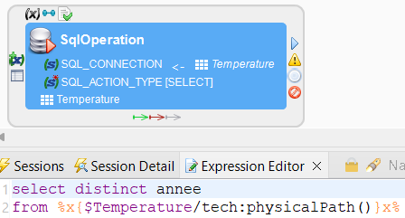

La syntaxe est la suivante :

<span id="com">%x{$ </span>
<span id="val">nom_metadata </span>
<span id="com">/tech: </span>
<span id="par">nom_variable_Xpath</span>
<span id="com">()}x% </span>

<span id="not">L'ensemble des variables Xpath sont disponibles</span>

1. Selectionner la metadata depuis Project Explorer
2. Clique droit sur cette dernière
3. Sélectionner Xpath Expressions Wizard
4. Une fenêtre apparaît (voir ci-dessous)

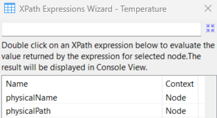


il existe une interface graphique qui liste et donne la valeur de toutes informations possibles

## <div id="titleSub2">1.2 Direct Bind</div>

* SQL Operation (Select)
* Scripting<br><br>

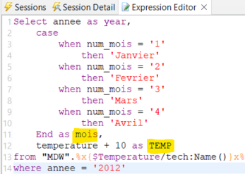

Utilisation de la syntaxe suivant pour récupérer la valeur du champ : <br>

<span id="com">: { </span>
<span id="val">nom_champ</span>
<span id="com"> } : </span>

<span id="not">La syntaxe ne demande pas d'espaces.</span><br>

Création d'une variable pour chaque itération sur la table

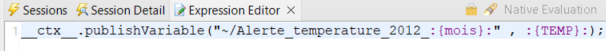

On constate que ça fonctionne en vérifiant les variables:

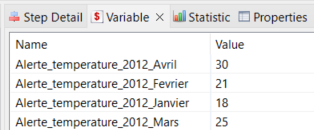

## <div id="titleSub2">1.3 Tag</div>

On va utiliser cette fonctionnalité pour générer plusieurs fichiers CSV à partir des données observés.

Les données :

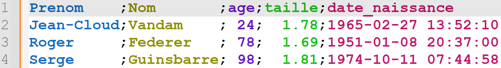

Les propriétés de la métadata du fichier CSV de sortie :

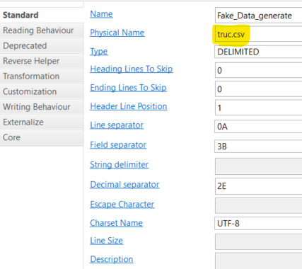

Le mapping :

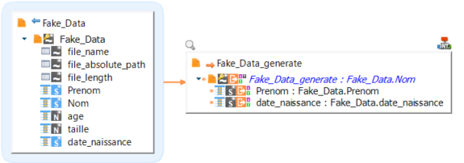

1. Il faut ajouter un tag sur le champs via ses propriétés

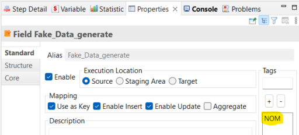

2. On peut maintenant faire appelle à la valeur associée à ce tag de la manière suivante

<span id="com"> [ </span>
<span id="val">nom_tag</span>
<span id="com"> ] </span>

On peut ainsi générer plusieurs fichiers CSV de la manière suivante :

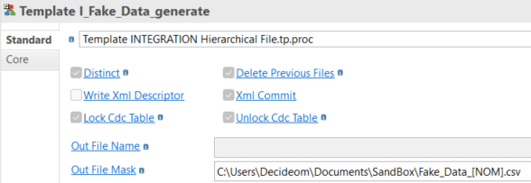

On obtient en sortie les fichiers suivants :

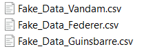

## <div id="titleSub2">1.4 Horodatage</div>

On va utiliser cette fonctionnalité pour générer un fichiers CSV dont le nom se terminera par la date et heure actuelles.

Ajouter simplement la syntaxe suivante dans le nom physique de la metadata de sortie:

<span id="com"> %x{md:formatDate(' </span>
<span id="val">yyyy-MM-dd-HHmmss</span>
<span id="com"> ')}x% </span>

Cela donne ceci :

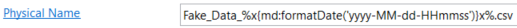

Après exécution du mapping on obtient le fichier suivant :

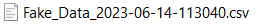

## <div id="titleSub2">1.5 Paramètre définit à la racine</div>

Lorsque l'on définit un paramètre à la raçine du process :

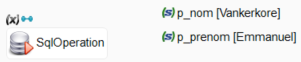

On peut appeler la valeur de ce paramétre de la façon suivante :

<span id="com"> '${~/ </span>
<span id="val">nom_parametre</span>
<span id="com"> }$' </span>

Exemple :

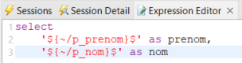

Résultat :

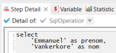

## <div id="titleSub2">1.6 Paramètre définit dans un composant</div>

Lorsque l'on définit un paramètre dans un composant :

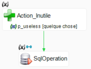

On peut appeler la valeur de ce paramétre de la façon suivante :

<span id="com"> '${~/ </span>
<span id="val">nom_composant</span>
<span id="com"> / </span>
<span id="val">nom_parametre</span>
<span id="com"> }$' </span>

Exemple :

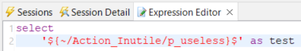

Résultat :

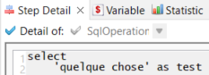

## <div id="titleSub2">1.7 Paramètre dynamqiue avec SQL</div>

<span id="att">Si la requête utilise les caractères suivants alors il faut les remplacer :</span>

| Expression | Substitut |
| --- | ----------- |
| > | & #62; |
| > | & gt; |
| < | & #60; |
| < | & lt; |
| >= | & gt;= |
| >= | & lt;= |

<span id="not">Note : L'espace entre le "&" et le "#" a été ajouté car Visual Studio Code interpréte l'élément. Il ne faut donc pas mettre d'espace lors de son utilisation.</span><br>

<span id="def"> Liste des types possibles : </span>
* String
* Integer
* Boolean
* Long

La syntaxe est la suivante :

```xml
<sqlToParameters>
	<parameter name="./parameter_path_and_name1" type="nom_type1">
		SQL_QUERY_1
	</parameter>
	...
	<parameter name="./parameter_path_and_nameN" type="nom_typeN">
		SQL_QUERY_N
	</parameter>
</sqlToParameters>
```

Notre process est le suivant :

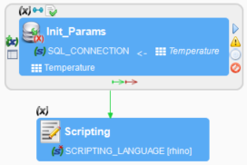

Exemple de paramètres : 

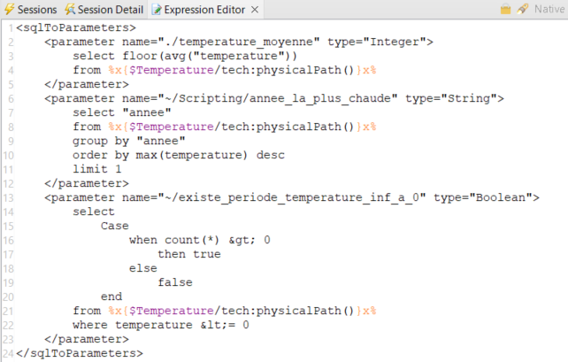

Après exécution, on constate que les paramètres sont bien placés:

+ temperature_moyenne : dans le composant "Init_Params"
+ annee_la_plus_chaude : dans le composant "Scripting"
+ existe_periode_temperature_inf_a_0 : dans la racine du process

## <div id="titleSub2">1.8 Paramètre dynamqiue avec Scripting</div>

Pour faire appel aux données du runtime, il faut utiliser la syntaxe suivante:

<span id="com"> __ ctx __ </span>

On peut donc appeler la méthode "publishVariable" comme dans l'exemple ci-dessous:

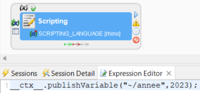

On a bien notre variable qui apparaît :

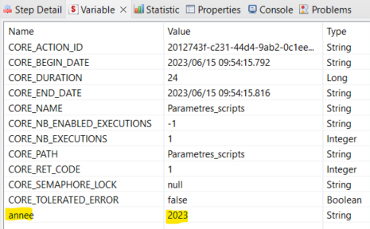

Lists non exhaustive des fonctionnalités :

| Expression | Description |
| --- | ----------- |
| getVariableValue(a) | Récupérer la valeur d'un paramètre/variable |
| publishVariable(x, y) | publier dans x la varaible y |
| < | & #60; |

## <div id="titleSub2">1.9 Lancer un delivery</div>

Exemple de process que l'on va publier :

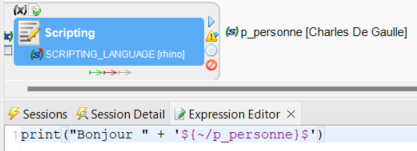

Lorsque l'on publie le process, il est indiqué dans la console l'emplacement où se trouve le fichier:

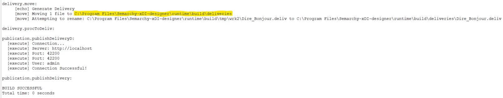

Assurer vous que le delivery soit bien présent :

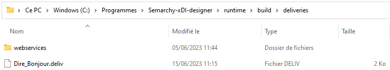

Réaliser le process qui va executer le delivery via le composant Operator System Command

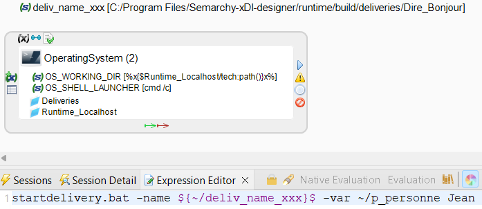

Comme on peut le constater, il faut respecter la syntaxe suivante:

<span id="com">startdelivery.bat </span>
<span id="par">-name </span>
<span id="val">nom_delivery </span>
<span id="par">-var </span>
<span id="val">nom_parametre1 </span>
<span id="val">valeur_parametre1 </span>
<span id="par">-var </span>
<span id="val">nom_parametre2 </span>
<span id="val">valeur_parametre2 </span>
...

Résultat

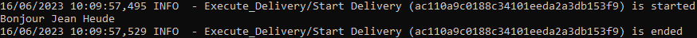

## <div id="titleSub2">1.10 Transformation</div>

On peut réaliser des transformations sur un fichier au moment de son appel dans un mapping sans altérer le fichier physique.

On peut réaliser des transformations soit:
- ligne par ligne
- sur l'ensemble du fichier

par exemple : 

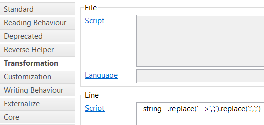

Les syntaxes à dispositions sont les suivantes :

| Cadre | Commande | Description |
| ----- | -------- | ----------- |
| File | <span id="com">__ in __ </span> | Désigne l'ensemble du contenu du fichier |
| File | <span id="com">__ out __ </span> | Désignera le contenu du fichier transformé |
| Line | <span id="com">__ string __ </span> | Désigne la ligne actuelle |
| Line | <span id="com">__ position __ </span> | Désigne le numéro actuelle de la ligne |

<span id="not">Le reste de la syntaxe est du Javascript.</span><br>

## <div id="titleSub2">1.11 Not Exist</div>

Soit :
- une table A en entrée
- une table B qui contient les données de la table A mais que l'on ne souhaite pas intégrer en sortie
- une table C en sortie

Exemple:

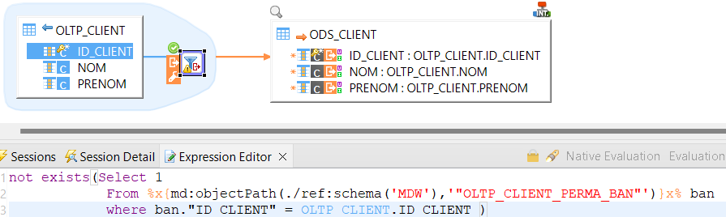

On peut appeler la metadata d'une table dans un mapping sans la présence de cette dernière, la syntaxe est la suivante :

<span id="com">%x{md:objectPath(./ref:schema( </span>
<span id="val"> nom_schema </span>
<span id="com">), </span>
<span id="val"> nom_table </span>
<span id="com">)}x% </span>

## <div id="titleSub2">1.12 Direct Bind conditionné</div>

Exemple de mapping:

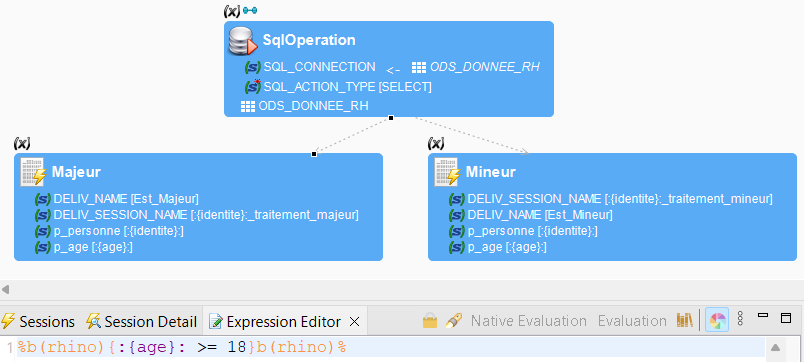

La syntaxe est la suivante:

<span id="com">%b(rhino){ </span>
<span id="val">condition </span>
<span id="com">}b(rhino)% </span>

généralement la condition aura cette forme :

<span id="com">:{ </span>
<span id="val">nom_champ </span>
<span id="com">}: </span>
<span id="val">opérateur valeur </span>

## <div id="titleSub2">1.13 Lien conditionné sur les stats</div>

Il est possible de déclencher l'exécution d'un composant sous condition que son prédécesseur valide une relation d'ordre statistique comme un nombre de lignes traités par exemple.

Syntaxe:

<span id="com">__ ctx __. </span>
<span id="val">methode </span>
<span id="com">(" </span>
<span id="val">stat_SQL </span>
<span id="com">" , " </span>
<span id="val">nom_Mapping </span>
<span id="com">") </span>
<span id="val">opérateur valeur</span>

dans les methode, on a cette liste non-exhaustive:

- sumVariable
- averageVariable
- countVariable
- minVariable
- maxVariable

dans les stat_SQL, on a cette liste non-exhaustive:

- IN_FILE_SIZE
- IN_NB_FILES
- SQL_NB_ROWS
- SQL_STAT_DELETE

Exemple :

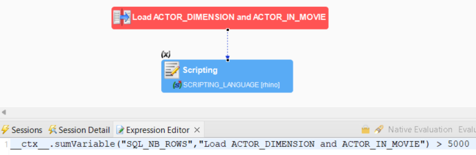

## <div id="titleSub2">1.14 Récupérer les données systèmes du process</div>

Il est possible de récupèrer l'ensemble des informations suivantes:

| Variable | Description |
| ----- | ----------- |
| CORE_BEGIN_DATE |  Startup day and time of the session |
| CORE_DURATION |  Duration of the session in milliseconds |
| CORE_END_DATE |  Day and time of the session completion |
| CORE_ENGINE_HOST |  Host of the Runtime engine processing the session |
| CORE_ENGINE_PORT |  Port of the Runtime engine processing the session |
| CORE_ROOT |  Name of the process containing the session |
| CORE_SESSION_CONFIGURATION |  Configuration used for this execution |
| CORE_SESSION_ID |  Unique identifier of the session |
| CORE_SESSION_NAME |  Name of this session |
| CORE_SESSION_TIMESTAMP |  Session startup timestamp |
| CORE_TEMPORARY_FOLDER |  Temporary folder for this session |

Le Syntaxe est la suivante :

<span id="com">__ ctx __.getVariableValue </span>
<span id="com">("/ </span>
<span id="val">Variable </span>
<span id="com">") </span>

## <div id="titleSub2">1.15 Appeler la valeur d'une metadata de type variable</div>

Utiliser la syntaxe suivante:

<span id="com">%{ </span>
<span id="val">nom_variable </span>
<span id="com">}% </span>

Exemple :

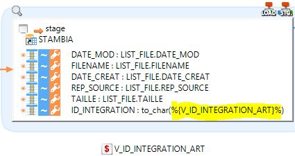

## <div id="titleSub">2. Metadata</div>

## <div id="titleSub2">2.1 Property Field</div>

1. Ajouter dans la métadata du fichier les Property Field<br><br>

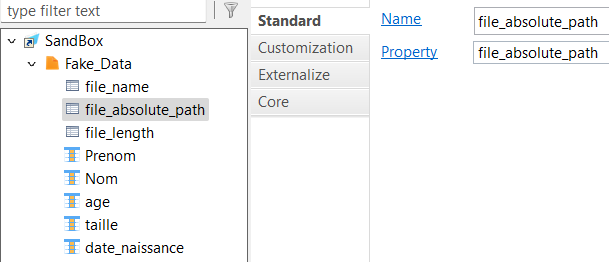

<span id="not">Le nom doit correspondre à la propriété.</span><br>

2. On peut les récupèrer les informations via un mapping

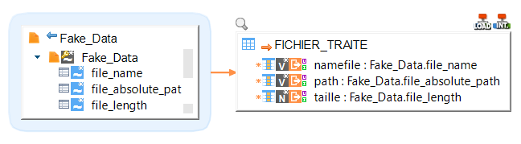

3. On constate que les valeurs ont bien été récupérées

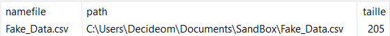

## <div id="titleSub2">2.2 Record</div>

Cela permet de définir un sous ensemble de données avec un filtre à partir d'un fichier.

On a les données en entrée :

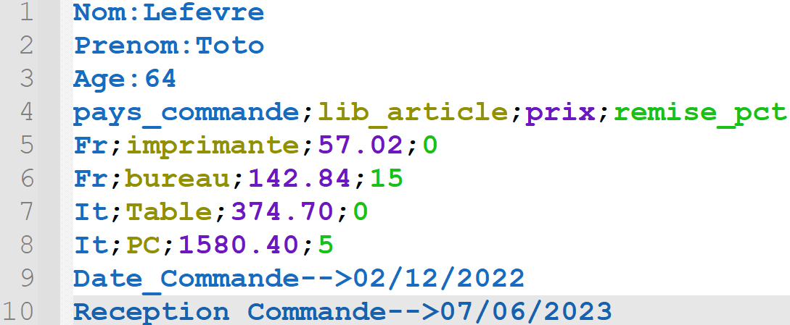

On constate la typologie suivante :

| Lignes | Typo |
| --- | ----------- |
| 1 à 3 | Header |
| 4 à 8 | Données |
| 9 à 10 | Footer |

On définit un filtre et les champs que l'on veux inclure :

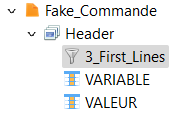

Les paramètres du filtre :

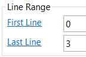

Les paramètres du filtre pour le record du footer :

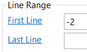

Une fois que c'est fait, on peut drag and drop le record dans un mapping :

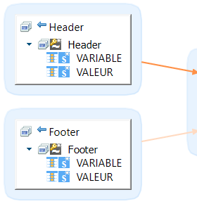

Les données ont bien été intégrées :

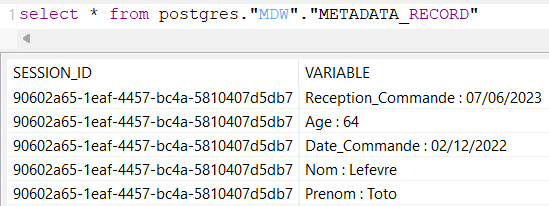

On peut filtrer à partir de la valeur observée sur une ligne :

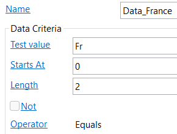


## <div id="titleSub">3. Composants</div>

## <div id="titleSub2">3.1 FileWait : Log automatisé</div>

Lorsque l'on drag and drop un schéma quelconque dans le composant "Wait for Files":

Stambia va automatiquement créer une table temporaire "IND_SESSION_FILE_OP_LST" qui contiendra beaucoup d'informations sur les fichiers identifiés après exécution du composant.

Exemple :

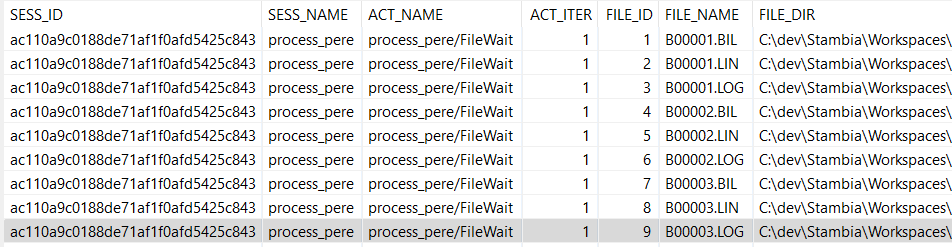

## <div id="titleSub2">3.2 Execute Delivery</div>


## <div id="titleSub">4. Log</div>

Pour rappel, la base de log est spécifié dans le fichier "engineParameters.xml" dont le dossier correspond à < runtime > / properties /

## <div id="titleSub2">4.1 Différence entre Execute Delivery et Drag and Drop</div>

1. Dans le cas du Drag and Drop

<span id="def">Soit P1 le process principale et P2 le process qui est drag and drop dans P1.</span>

<span id="not">P1 et P2 auront le même identifiant de session.</span>

<span id="att">Pour MEP (Mise en production), il faut déployer P1 uniquement.</span>

2. Dans le cas de l'execute Delivery

<span id="def">Soit P1 le process principale et P2 le process qui est appelé par un Execute Delivery et via un direct bind.</span>

Exemple:

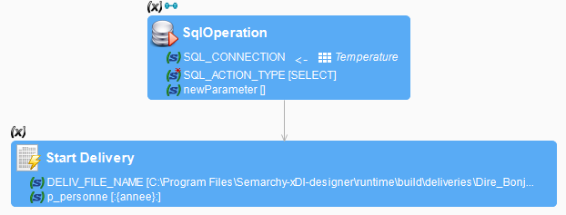

<span id="not">P1 et tous les enfants de P2 auront un identifiant de session différent.</span>

Preuve:

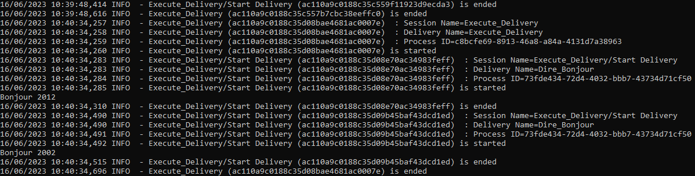

| Execution | Id_Session |
| --- | ----------- |
| P1 | ac110a9c0188c35d08bae4681ac0007e |
| P2_1 | ac110a9c0188c35d08e70ac34983feff |
| P2_2 | ac110a9c0188c35d09b45baf43dcd1ed |

<span id="att">Pour MEP (Mise en production), il faut déployer P1 et P2.</span>

## <div id="titleSub2">4.2 Présentation rapide des tables de logs automatiquement générées</div>

| Nom_Table | Granularité_1 | Unicité | Date | Stat | Description |
| --------- | ------------- | ------- | ---- | ---- | ----------- |
| stb_log_action_act | sess_id | sess_id / act_id / act_iter | oui | non | Récupérer des informations diverses sur les actions durant l'exécution du process |
| stb_log_action_prop_acp | sess_id | sess_id / acp_num | non | non | |
| stb_log_session_stat_sst | sess_id | sess_id / acp_short_name | non | oui | Identifier les valeurs des propriétés des composants après exécution du process |
| stb_log_action_sprop_asp | dlv_id | dlv_id / act_id / acp_short_name | non | non | Contient les valeurs renseignées de certains composants par le dév |
| stb_log_action_stat_ast | sess_id | sess_id / act_id / act_iter | non | non | Retrouver toutes les valeurs de chaque paramétre durant l'exécution du process |
| stb_log_link_lnk | sess_id | sess_id / lnk_id / lnk_iter / lnk_status | non | non | Obtenir les informations relatives aux liens |
| stb_log_session_sess | dlv_id | dlv_id / sess_id | oui | non | Recence l'ensemble des informations liées à l'envrionnement dans lequel a été exécuté le process |

## <div id="titleSub2">4.3 Où retrouver le message d'erreur du composant "Raise Error" dans les logs</div>

Pour visualiser le contenu du message d'erreur relatif au composant "Raise Error":

```sql
select *
from stb_log_action_sprop_asp
where acp_short_name = 'MESSAGE' 
  and asp_src_var is not null
```

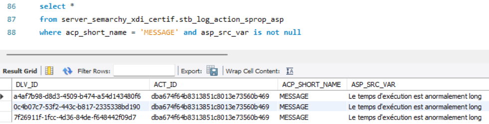

Pour identifier si le composant "Raise Error" a été exécuté:


## <div id="titleSub">5. Performance</div>

## <div id="titleSub2">5.1 Insertion de lignes via SQL Operation</div>

Dans le cadre d'une insertion de lignes en base via deux composants SQL Operation (le premier pour la sélection et le second pour l'insertion).


| caractéristiques | temps d'exécution |
| ---------------- | ----------- |
| DirectBind conditionné (oui) ; SQL_ACTION_TYPE (INSERT) | 51 secondes | 
| DirectBind conditionné (non) ; SQL_ACTION_TYPE (DDL_DML) | 21 secondes |
| DirectBind conditionné (non) ; SQL_ACTION_TYPE (INSERT) | 1 seconde |


## <div id="titleSub">99. Problème rencontré</div>


# <span id="titleMain">Titre du document</span>

## <div id="titleSub">0. Utiliser le CSS Interne</div>
<br>

<span id="com">Nom_Fonction </span>
<span id="par">Paramétre</span>
<span id="val"> Valeur </span>

Pour croiser les informations de différentes tables on réalise des <span id="imp">jointures</span>.<br>
<span id="def">Base de données: outils permettant de stocker et de structurer nos données.</span><br>
<span id="not">Toutes les requêtes SQL suivent un plan d'exécution qui peut être optimisé (Demander de l'aide à un DBA orienté analyse).</span><br>
<span id="att">DBeaver est un logiciel qui réalise un lock sur une table lors d'un select.</span><br>

## <div id="titleSub">1. Titre</div>

## <div id="titleSub2">1.1 Sous-titre</div> 

## <div id="titleSub">2. Joindre une image</div>

![image info] (<span id="param">Chemin relatif du fichier image</span>)

## <div id="titleSub">3. Les styles</div>

*En italic*<br>
**En gras**<br>
<u>Souligné</u><br>
<mark>Surligné en jaune</mark><br>

## <div id="titleSub">4. Mise en évidence</div>

La mise en évidence c'est ça : `<Accepter>`, ni plus ni moins.<br>
Rappel : Alt Gr + 7<br>

## <div id="titleSub">5. Trois façons de créer une barre horizontale</div>

---

***

___


## <div id="titleSub">6. Créer un bloc avec coloration syntaxique</div>

```json
{
  "firstName": "John",
  "lastName": "Smith",
  "age": 25
}
```

```xml
<?xml version="1.0" encoding="utf-8"?>
<Root>
  <Customers>
    <Customer CustomerID="GREAL">
      <CompanyName>Guerin ravitaille</CompanyName>
    </Customer>
</Root>
```

## <div id="titleSub">7. Créer des blocs imbriqués</div>

>Bloc père

>>Premier bloc fils<br>
>>seconde ligne du bloc

>>Second bloc fils<br>
>>seconde ligne du bloc

## <div id="titleSub">8. Créer un lien</div>

Texte avant mon lien [Nom du site](https://google.com) texte après mon lien.
<br>  


## <div id="titleSub">9. Liste ordonnée</div>

1. Premier
2. Second
3. Troisième

## <div id="titleSub">10. Liste non ordonnée</div>

* Maillot de bain
* Serviette
* Savon

## <div id="titleSub">11. Réaliser un tableau à 2 entrées</div>

| Numéro | Département |
| --- | ----------- |
| 02 | Ainse |
| 60 | Oise |
| 80 | Somme |

## <div id="titleSub">12. Liste de cases à cocher</div>

- [x] Write the press release
- [ ] Update the website
- [ ] Contact the media

## <div id="titleSub">13. Intégrer une vidéo youtube</div>

- [ ] Visibilité via la preview de VS Code
- [x] Visibilité via un navigateur web

<div class="video-responsive">
  <iframe 
    width="560" 
    height="315" 
    src="https://www.youtube.com/embed/caXHwYC3tq8" 
    title="YouTube video player" 
    frameborder="0" 
    allow="accelerometer; autoplay; clipboard-write; encrypted-media; gyroscope; picture-in-picture" 
    allowfullscreen>
  </iframe>
</div>