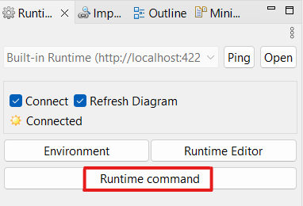
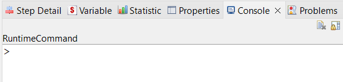
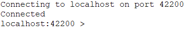
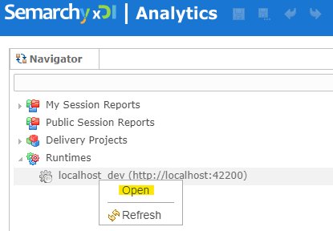
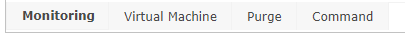
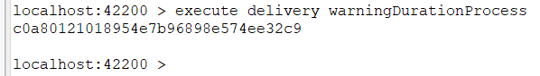
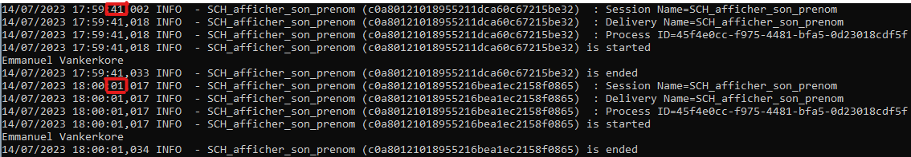
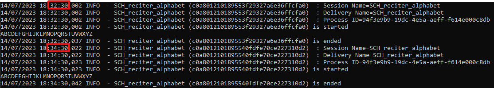

<head>
<style>
#titleMain {color:#808080; font-size:40px; font-weight:bold; font-family:"Cambria"}
#titleSub {color:#677179; font-size:30px; font-weight:bold; font-family: "Verdana"; margin-top:30px; margin-bottom:25px}
#titleSub2 {color:#563C5C; font-size:20px; font-weight:bold; margin-bottom:20px}
#titleSubSub {}
#com {color:#FF00FF; font-size:18px "Carnivalee Freakshow"}
#par {color:#32CD32; font-size:18px "Carnivalee Freakshow"}
#val {color:#87CEFA; font-size:18px "Carnivalee Freakshow"}
#imp {color:#e21313; font:bold 20px "Carnivalee Freakshow"}
#def {color:#90EE90; font-size:18px "Carnivalee Freakshow"}
#not {color:#1E90FF; font-size:18px "Carnivalee Freakshow"}
#att {color:#ffa500; font-size:18px "Carnivalee Freakshow"}
.video-responsive {
 overflow:hidden;
 padding-bottom:56.25%; 
 position:relative;
 height:0;
}
.video-responsive iframe {
 left:0;
 top:0;
 height:100%;
 width:100%;
 position:absolute;
}
</style>
</head>

# <span id="titleMain">Runtime Commands</span>

## <div id="titleSub">0 Où entrer sa commande</div>

C'est idiot ! Mais assurez-vous que le runtime soit lancé.

> Première possibilité : via Designer

Cliquer sur "Runtime command"



Une nouvelle fenêtre est apparue:



Il faut maintenant se connecter au runtime en utilisant la commande suivante :

<span id="com">connect to </span>
<span id="val">nom_serveur </span>
<span id="par">port </span>
<span id="val">valeur_port </span>
<span id="par">user </span>
<span id="val">valeur_user </span>
<span id="par">password </span>
<span id="val">valeur_password </span>

<span id="not">Les informations relatives à l'authentification se trouve dans le fichier "engineParameters.xml" propre au runtime </span>

Une fois que l'on est connecté, on a ceci:



> Seconde possibilité : via Analytics

Assurez-vous que le serveur Tomcat soit lancé

Ouvrir Analytics avec l'URL suivante http://localhost:8080/semarchy-xdi-analytics/semarchy

Ouvrir le runtime de la manière suivante:



Selectionner l'onglet command:



## <div id="titleSub">1 Obtenir la version du runtime </div>

<span id="com">versions </span>

## <div id="titleSub">2 Lister l'ensemble des deliveries </div>

<span id="com">get deliveries </span>

il est possible de préciser la liste des champs à afficher (%name, %builduser, %configuration, %id, %packageid, %processid, %username, %version, %builddate et %exportdate):

<span id="com">get deliveries </span>
<span id="par">format </span>
<span id="val">%name;%id;%builddate </span>

il est possible de préciser la liste des deliveries à afficher:

<span id="com">get deliveries </span>
<span id="par">id </span>
<span id="val">7185a43d-06a8-4660-86f7-602c495d7d9b </span>

## <div id="titleSub">3 Supprimer un delivery </div>

<span id="com">remove delivery </span>
<span id="val">nom_delivery </span>

## <div id="titleSub">4 Lancer l'exécution d'un delivery </div>

<span id="com">execute delivery </span>
<span id="val">nom_delivery </span>

Le terminal renvoie la SESSION_ID correspondant à l'exécution:



## <div id="titleSub">5. Plannifier l'exécution d'un delivery</div>

<span id="not">Il existe un site qui aide à la construction du CRON: </span> https://crontab.guru/ 

La syntaxe globale est :

<span id="com">schedule delivery </span>
<span id="val">nom_delivery </span>
<span id="par">jobName </span>
<span id="val">libelle_interne_delivery </span>
<span id="par">var </span>
<span id="val">path valeur_variable </span>
<span id="par">start </span>
<span id="val">date_de_commencement </span>
<span id="par">end </span>
<span id="val">date_de_fin </span>
<span id="par">cron </span>
<span id="val">valeur_du_cron </span>

## <div id="titleSub2">5.1 À des moments ponctuels</div>

Par exemple: toutes les 1 ière et à la 41 ième secondes.

La valeur CRON est la suivante: "1,41 * * * * ? *"



## <div id="titleSub2">5.1 À intervalle de temps régulier</div>

Par exemple: toutes les 2 minutes et à la 30 ième seconde.

La valeur CRON est la suivante: "30 */2 * * * ? *"



## <div id="titleSub2">5.2 De manière continue</div>

Par exemple: à la 5 ième seconde entre la 50 ième et la 55 ième minute.

La valeur CRON est la suivante: "5 50-55 * * * ? *"


# <span id="titleMain">Titre du document</span>

## <div id="titleSub">0. Utiliser le CSS Interne</div>
<br>

<span id="com">Nom_Fonction </span>
<span id="par">Paramétre</span>
<span id="val"> Valeur </span>

Pour croiser les informations de différentes tables on réalise des <span id="imp">jointures</span>.<br>
<span id="def">Base de données: outils permettant de stocker et de structurer nos données.</span><br>
<span id="not">Toutes les requêtes SQL suivent un plan d'exécution qui peut être optimisé (Demander de l'aide à un DBA orienté analyse).</span><br>
<span id="att">DBeaver est un logiciel qui réalise un lock sur une table lors d'un select.</span><br>

## <div id="titleSub">1. Titre</div>

## <div id="titleSub2">1.1 Sous-titre</div> 

## <div id="titleSub">2. Joindre une image</div>

![image info] (<span id="param">Chemin relatif du fichier image</span>)

## <div id="titleSub">3. Les styles</div>

*En italic*<br>
**En gras**<br>
<u>Souligné</u><br>
<mark>Surligné en jaune</mark><br>

## <div id="titleSub">4. Mise en évidence</div>

La mise en évidence c'est ça : `<Accepter>`, ni plus ni moins.<br>
Rappel : Alt Gr + 7<br>

## <div id="titleSub">5. Trois façons de créer une barre horizontale</div>

---

***

___


## <div id="titleSub">6. Créer un bloc avec coloration syntaxique</div>

```json
{
  "firstName": "John",
  "lastName": "Smith",
  "age": 25
}
```

```xml
<?xml version="1.0" encoding="utf-8"?>
<Root>
  <Customers>
    <Customer CustomerID="GREAL">
      <CompanyName>Guerin ravitaille</CompanyName>
    </Customer>
</Root>
```

## <div id="titleSub">7. Créer des blocs imbriqués</div>

>Bloc père

>>Premier bloc fils<br>
>>seconde ligne du bloc

>>Second bloc fils<br>
>>seconde ligne du bloc

## <div id="titleSub">8. Créer un lien</div>

Texte avant mon lien [Nom du site](https://google.com) texte après mon lien.
<br>  


## <div id="titleSub">9. Liste ordonnée</div>

1. Premier
2. Second
3. Troisième

## <div id="titleSub">10. Liste non ordonnée</div>

* Maillot de bain
* Serviette
* Savon

## <div id="titleSub">11. Réaliser un tableau à 2 entrées</div>

| Numéro | Département |
| --- | ----------- |
| 02 | Ainse |
| 60 | Oise |
| 80 | Somme |

## <div id="titleSub">12. Liste de cases à cocher</div>

- [x] Write the press release
- [ ] Update the website
- [ ] Contact the media

## <div id="titleSub">13. Intégrer une vidéo youtube</div>

- [ ] Visibilité via la preview de VS Code
- [x] Visibilité via un navigateur web

<div class="video-responsive">
  <iframe 
    width="560" 
    height="315" 
    src="https://www.youtube.com/embed/caXHwYC3tq8" 
    title="YouTube video player" 
    frameborder="0" 
    allow="accelerometer; autoplay; clipboard-write; encrypted-media; gyroscope; picture-in-picture" 
    allowfullscreen>
  </iframe>
</div>