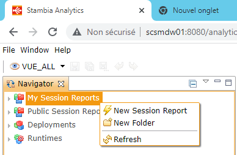
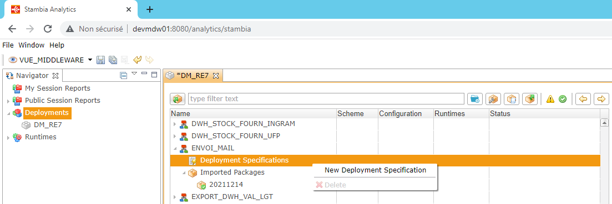
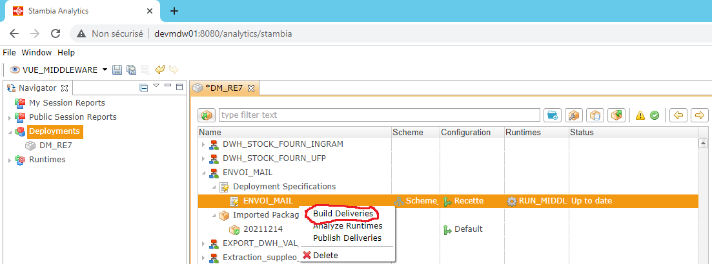
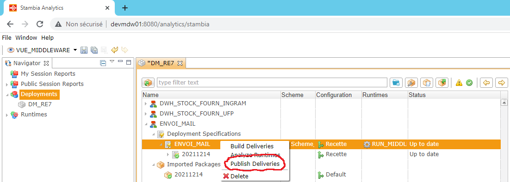
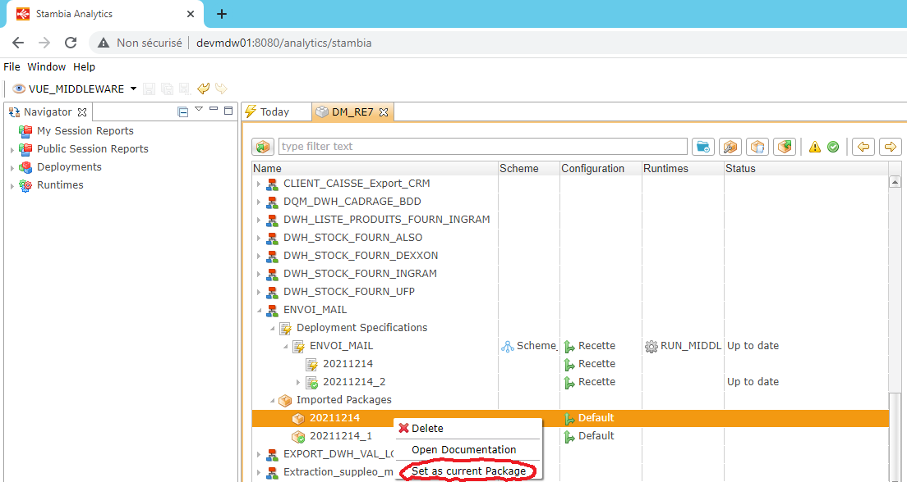

<head>

</head>

# Tuto sur les fondamentaux Stambia Analytics

## 0. Se connecter à Stambia Analytics

Prod : http://scsmdw01:8080/analytics/stambia

User : ntico 
Mot de passe : Nt1c0@fr

## 1. Selectionner un type de vue
 

étape 1 : Identifier l'image ci-dessous en haut à gauche de l'application

étape 2 : Selectionner toutes les vues ou une vue en particulier

## 2. Créer ses propres suivis (non publics)
 

étape 1 : Identifier la partie "My Session Reports"

étape 2 : Faire un clic droit sur "My Session Reports"

étape 3 : Clique gauche sur "New Folder" pour ajouter un nouveau dossier

étape 4 : Clique gauche sur "New Session Report" pour ajouter un nouveau suivi

## 3. Acccéder aux suivis (publics)
 

étape 1 : Cliquer sur "Public Session Reports"

## 4. Publier un nouveau process
 

étape 0 : Sur Stambia Designer

Cliquer droit sur le process "Build/Execute"

Se rendre sur le process "Build"

Cliquer gauche sur "Package With Documentation"

Se rendre le dossier "D:\stambiaDesigner\Stambia_Designer_S19-0-27\stambiaRuntime\build\packages" en local

Vous pouvez constatez la présence d'un fichier ayant la forme suivante : {nom_du_process}.pck

étape 1 : Sélectionner la partie "Deployments"

étape 2 : Sélectionner avec un double cilque un gestionnaire de déploiement

étape 3 : Importer un package (fichier permettant la construction du delivery)

étape 4 : Sélectionner le package sur votre espace de stockage en local

étape 5 : Votre process apparait dans la fenêtre, vous pouvez le drag and drop

En l'état, votre package est : 
  importé :     oui 
Le livrable est : 
  construit :   non 
  deployé :     non

étape 6 : Ajouter une spécification de déploiement, clique droit sur "Deployment Specifications"

étape 7 : Sélectionner un schema de déploiement

étape 8 : Ajouter un schéma associé à un runtime et vérifier qu'il n'y pas pas d'informations manquantes

étape 9 : Selectionner la spécification de déploiement

étape 10 : Construction du delivery, clique droit et selectionner "Build Deliveries"

On a construit notre livrable, Donc.

En l'état, votre package est : 
  importé :     oui 
Le livrable est : 
  construit :   oui 
  deployé :     non

étape 11 : Publication de notre livrable, clique droit sur la spécification de déploiement

étape 12 : Ne pas oublié de sauvegarder --> Ctrl + S

C'est fini, le process est publié !

## 5. Importer un package dont le process a déjà été publié
 

étape 1 : Importer le package associé à la nouvelle version du process

étape 2 : Observer à présent votre process notifié de la façon suivante

étape 3 : Observer la notification associée au livrable publié

Explication : Lorsque l'on importe un nouveau package d'un process déjà existant, Stambia Analytics considère qu'il faut prendre en compte le package le plus récent. Mais le package le plus récent ne correspond pas à la version du livrable publié.

Il nous faut donc construire un nouveau livrable à partir nouveau package

étape 4 : Construction du delivery, clique droit et selectionner "Build Deliveries"

 

étape 5 : Publication de notre livrable, clique droit sur la spécification de déploiement

## 6. Revenir sur un package antérieur
 

étape 1 : Sélectionner l'ancien package

étape 2 : Définir le package comme celui à utiliser lors de la construction

## 7. Consulter l'historique des exécutions d'un process sur un runtime
 

étape 1 : Se rendre dans la section "Runtimes"

étape 2 : Double clique gauche sur le runtime

étape 3 : Ouvrir "wsdl" pour les web services ou "default" pour les autres

étape 4 : Double clique gauche sur un process

Une nouvelle fenêtre apparaît, c'est l'historique des exécution du process sur ce runtime.

## 8. Consulter les paramètres lors de l'exécution d'un process sur un runtime
 

étape 1 : Se rendre dans la section "Runtimes"

étape 2 : Double clique gauche sur le runtime

étape 3 : Ouvrir "wsdl" pour les web services ou "default" pour les autres

étape 4 : Double clique gauche sur un process

étape 5 : Selection une exécution est vous trouverez les paramètres avec lesquels il a été lancé

## 9. Vérifier que l'on est bien connecté aux runtimes
 

étape 1 : Se rendre dans l'onglet "Logs"

## 10. Relancer l'application Apache Tomcat
 

étape 1: Appuyer sur la touche windows

étape 2: Entrer mstsc

étape 3: Appuyer sur entrée

étape 4: Dans la fenêtre de connexion bureau à distance, entrer "scsmdw01"

étape 5: Appuyer sur "Connexion"

étape 6: Saisir pour le user "scsmdw01\administrateur"

étape 7: Saisir pour le password "AdminTopS"

étape 8: Se rendre dans l'application "Services"

étape 9: Arrêter le service "Apache Tomcat 8.5 Tomcat8"

étape 10: si étape 9 ne fonctionne pas, faire un clique droit sur l'application "Commons Daemon Service Runner" et clique gauche sur "Fin de tâche"

étape 11: Démarrer le service "Apache Tomcat 8.5 Tomcat8"

étape 12: Fermer le bureau à distance