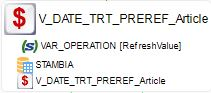

<head>
<style>
#boiteimagetexte {display:flex; align-items: flex-start}
#titleMain {color:#808080; font-size:40px; font-weight:bold; font-family:"Cambria"}
#titleSub {color:#677179; font-size:30px; font-weight:bold; font-family: "Verdana"; margin-top:30px; margin-bottom:25px}
#titleSub2 {color:#563C5C; font-size:20px; font-weight:bold; margin-bottom:20px}
#titleSubSub {}
#com {color:#FF00FF; font-size:18px "Carnivalee Freakshow"}
#par {color:#32CD32; font-size:18px "Carnivalee Freakshow"}
#val {color:#87CEFA; font-size:18px "Carnivalee Freakshow"}
#imp {color:#e21313; font:bold 20px "Carnivalee Freakshow"}
#def {color:#90EE90; font-size:18px "Carnivalee Freakshow"}
#not {color:#1E90FF; font-size:18px "Carnivalee Freakshow"}
#att {color:#ffa500; font-size:18px "Carnivalee Freakshow"}
</style>
</head>

# <span id="titleMain">Tuto sur les fondamentaux Stambia</span>

- [Tuto sur les fondamentaux Stambia](#tuto-sur-les-fondamentaux-stambia)
  - [1. Création de métadatas](#1-création-de-métadatas)
  - [1.1 CSV](#11-csv)
  - [1.2 XML](#12-xml)
  - [1.3 Web Service](#13-web-service)
  - [2. Selectionner l'affichage des champs d'une table](#2-selectionner-laffichage-des-champs-dune-table)
  - [3. Réaliser un mapping simple](#3-réaliser-un-mapping-simple)
  - [3.1 Définir le type de mapping en sortie](#31-définir-le-type-de-mapping-en-sortie)
  - [3.2 Lancer l'exécution d'un mapping](#32-lancer-lexécution-dun-mapping)
  - [3.3 Modifier la règle métier du mapping](#33-modifier-la-règle-métier-du-mapping)
  - [3.4 Modifier la jointure entre deux tables](#34-modifier-la-jointure-entre-deux-tables)
  - [3.5 Dédoublonnage des valeurs lors d'un mapping](#35-dédoublonnage-des-valeurs-lors-dun-mapping)
  - [4. Réaliser un filtre sur le champ d'une table](#4-réaliser-un-filtre-sur-le-champ-dune-table)
  - [4.1 Modifier la règle d'un filtre](#41-modifier-la-règle-dun-filtre)
  - [5. Créer un stage](#5-créer-un-stage)
  - [5.1 Ajouter un champ dans le stage](#51-ajouter-un-champ-dans-le-stage)
  - [5.2 Définir l'expression d'un champ d'un stage](#52-définir-lexpression-dun-champ-dun-stage)
  - [6. Se familiariser avec l'interface](#6-se-familiariser-avec-linterface)
  - [6.1 Identifier l'item dans "Project Explorer" à partir du Designer](#61-identifier-litem-dans-project-explorer-à-partir-du-designer)
  - [6.2 Réarranger les entités d'un mapping ou d'un process](#62-réarranger-les-entités-dun-mapping-ou-dun-process)
  - [7. À savoir / Très important](#7-à-savoir--très-important)
  - [8. Les items/logos à connaître par coeur](#8-les-itemslogos-à-connaître-par-coeur)
  - [9. Avant l'exécution du process](#9-avant-lexécution-du-process)
  - [10. En cas d'echec durant l'exécution d'un process](#10-en-cas-dechec-durant-lexécution-dun-process)
  - [11. Composants de la palette](#11-composants-de-la-palette)
  - [11.1 Les liens](#111-les-liens)
  - [11.2 Les process neutres](#112-les-process-neutres)
  - [11.3 Les requêtes SQL](#113-les-requêtes-sql)
  - [12. Après l'exécution du process](#12-après-lexécution-du-process)
  - [12.1 Mettre à jour son workspace](#121-mettre-à-jour-son-workspace)
  - [12.2 Pousser son travail vers le SVN](#122-pousser-son-travail-vers-le-svn)
  - [12.3 Revenir à la dernière version du SVN](#123-revenir-à-la-dernière-version-du-svn)
  - [13. Gestion des conflits](#13-gestion-des-conflits)
  - [14. Atteindre un mapping depuis un process](#14-atteindre-un-mapping-depuis-un-process)
  - [15. Identifier le qui utilise quoi](#15-identifier-le-qui-utilise-quoi)
  - [16. SQL to parameter](#16-sql-to-parameter)
  - [16.1 Définition en début de process](#161-définition-en-début-de-process)
  - [16.2 Utilisation dans un mapping](#162-utilisation-dans-un-mapping)
  - [17 Afficher la date et l'heure actuelle](#17-afficher-la-date-et-lheure-actuelle)
  - [18 Ajouter un repository dans son workspace depuis le SVN](#18-ajouter-un-repository-dans-son-workspace-depuis-le-svn)
  - [19 Récupèrer la version du runtime](#19-récupèrer-la-version-du-runtime)
  - [19.1 Depuis Analytics](#191-depuis-analytics)
  - [20. Redéfinir les liens entre les différentes entitées du workspace](#20-redéfinir-les-liens-entre-les-différentes-entitées-du-workspace)
  - [21. Web Service, utilisation de la méthode (verb) GET](#21-web-service-utilisation-de-la-méthode-verb-get)
  - [21.1 Exemple 1 : 1 query parameter](#211-exemple-1--1-query-parameter)
  - [22. Mise en recette depuis designer sur le serveur de dev](#22-mise-en-recette-depuis-designer-sur-le-serveur-de-dev)
  - [23. Mise en recette depuis Analytics](#23-mise-en-recette-depuis-analytics)
  - [24. Utilisation du XML en In et en Out dans un mapping](#24-utilisation-du-xml-en-in-et-en-out-dans-un-mapping)
  - [25. Réaliser une condition en fonction de la valeur d'une variable (System) de Stambia](#25-réaliser-une-condition-en-fonction-de-la-valeur-dune-variable-system-de-stambia)
  - [26. Rendre obligatoire l'exécution d'un sous process avant de passer à la suite](#26-rendre-obligatoire-lexécution-dun-sous-process-avant-de-passer-à-la-suite)
  - [27. Faire appel à une variable](#27-faire-appel-à-une-variable)
  - [28. Attendre l'apparition d'un fichier](#28-attendre-lapparition-dun-fichier)
  - [29. Déplacer un ou des fichiers vers un autre dossier](#29-déplacer-un-ou-des-fichiers-vers-un-autre-dossier)
  - [30. Réduire totalement l'arborescence de l'onglet Project Explorer](#30-réduire-totalement-larborescence-de-longlet-project-explorer)
  - [31. Supprimer les champs qui n'existent plus en base lors d'un reverse](#31-supprimer-les-champs-qui-nexistent-plus-en-base-lors-dun-reverse)
  - [32. Réaliser une comparaison entre un élément de votre workspace et le même élement du SVN](#32-réaliser-une-comparaison-entre-un-élément-de-votre-workspace-et-le-même-élement-du-svn)
  - [33. Ajouter un champ qui indique la valeur du rang pour un élément par rapport à son noeud père dans un fichier XML](#33-ajouter-un-champ-qui-indique-la-valeur-du-rang-pour-un-élément-par-rapport-à-son-noeud-père-dans-un-fichier-xml)
  - [34. Utiliser la valeur d'une variable native d'un composant après son exécution](#34-utiliser-la-valeur-dune-variable-native-dun-composant-après-son-exécution)
  - [35. Lancer l'exécution d'une ligne de commande](#35-lancer-lexécution-dune-ligne-de-commande)
  - [35. Utiliser les paramètres d'une metadata](#35-utiliser-les-paramètres-dune-metadata)
  - [36. Copier et coller un composant](#36-copier-et-coller-un-composant)
  - [37. Réaliser un union dans un mapping](#37-réaliser-un-union-dans-un-mapping)
  - [38. Analyse des symboles lors d'une recherche d'impact](#38-analyse-des-symboles-lors-dune-recherche-dimpact)
  - [39. Attention à la méthode d'intégration durant un stage](#39-attention-à-la-méthode-dintégration-durant-un-stage)
  - [40. Obligation dans le SQL to parameter](#40-obligation-dans-le-sql-to-parameter)
  - [41. Consulter rapidement la nature d'un champ depuis un mapping](#41-consulter-rapidement-la-nature-dun-champ-depuis-un-mapping)
  - [42. Prioriser l'ordre d'exécution des jointures dans un mapping](#42-prioriser-lordre-dexécution-des-jointures-dans-un-mapping)
  - [43. Rechercher rapidement un process déjà exécuté](#43-rechercher-rapidement-un-process-déjà-exécuté)
  - [44. Modifier la structure d'un JSON](#44-modifier-la-structure-dun-json)
  - [45. JSON : La différence entre Array [] et Object {}](#45-json--la-différence-entre-array--et-object-)
  - [46. Accepter l'erreur sur le composant qui récupère des fichiers à l'aide d'un SFTP](#46-accepter-lerreur-sur-le-composant-qui-récupère-des-fichiers-à-laide-dun-sftp)
  - [47. Réaliser un Direct Bind](#47-réaliser-un-direct-bind)
  - [48. Zipper un fichier](#48-zipper-un-fichier)

## <div id="titleSub">1. Création de métadatas</div>

## <div id="titleSub2">1.1 CSV</div> 

étape 1: Créer une nouvelle métadata


étape 2: Choisir le type "File Server"


étape 3: Se laisser guider par l'assistant et enregistrer

## <div id="titleSub2">1.2 XML</div> 

## <div id="titleSub2">1.3 Web Service</div> 

étape 1: Créer une metadata avec le type suivant:


## <div id="titleSub">2. Selectionner l'affichage des champs d'une table</div>

Sélectionner la table et cliquer ici (voir ci-dessous)


## <div id="titleSub">3. Réaliser un mapping simple</div>

À gauche le mapping (in) et à droite la table à mapper (out)

étape 1: Faites un glisser déposer du champ in vers le champ out<br>
étape 2: Sélectionner "Map"

## <div id="titleSub2">3.1 Définir le type de mapping en sortie</div>

étape 1: sélectionner le champ du in<br>
étape 2: sélectionner le champ du out<br>
étape 3: cliquer sur A pour "Aggreger", I pour "Insérer" et U pour "Mettre à jour" (voir ci-dessous)


## <div id="titleSub2">3.2 Lancer l'exécution d'un mapping</div>

Depuis l'éditeur de Designer

étape 1: clique droit n'importe où et sélectionner "Execute" (voir ci-dessous)


## <div id="titleSub2">3.3 Modifier la règle métier du mapping</div>

Depuis l'éditeur de Designer

étape 1: sélectionner le champ du in<br>
étape 2: sélectionner le champ du out<br>
étape 3: cliquer sur l'item et choisir entre "Source", "Staging Area" ou "Target"


## <div id="titleSub2">3.4 Modifier la jointure entre deux tables</div>

Depuis l'éditeur de Designer

étape 1: sélectionner la jointure<br>
étape 2: se rendre dans l'onglet "Propriété" (voir ci-dessous)


## <div id="titleSub2">3.5 Dédoublonnage des valeurs lors d'un mapping</div>

Depuis l'éditeur de Designer

étape 1: sélectionner l'item d'intégration (voir ci-dessous)


étape 2: Se rendre dans les propriétés et cocher la case représentée ci-dessous


## <div id="titleSub">4. Réaliser un filtre sur le champ d'une table</div>

Depuis l'éditeur de Designer

étape 1: sélectionner le champ d'une table<br>
étape 2: faites un drag and drop vers un espace vide (voir ci-dessous)


## <div id="titleSub2">4.1 Modifier la règle d'un filtre</div>

étape 1: sélectionner le filtre<br>
étape 2: réaliser la modification prévue à cet effet (voir ci-dessous)


## <div id="titleSub">5. Créer un stage</div>

Depuis l'éditeur "Project Explorer"

étape 1: sélectionner un schéma<br>
étape 2: drag and drop dans la partie Designer (dans un espace vide)

alternative

étape 1: sélectionner un schéma<br>
étape 2: drag and drop sur le lien entre le in et le out

## <div id="titleSub">5.1 Ajouter un champ dans le stage</div>

étape 1: sélectionner le stage<br>
étape 2: cliquer sur l'item (voir ci-dessous)


## <div id="titleSub2">5.2 Définir l'expression d'un champ d'un stage</div>

Depuis l'éditeur de Designer

étape 1: sélectionner le champ<br>
étape 2: se rendre dans l'onglet "Expresion" et rédiger l'expression


## <div id="titleSub">6. Se familiariser avec l'interface</div>

## <div id="titleSub2">6.1 Identifier l'item dans "Project Explorer" à partir du Designer</div>

De façon automatique

étape 1: Activer la fonctionnalité en cliquant sur le bouton ci-dessous


De façon manuelle

étape 1: Sélectionner une entité (schéma, base de donnée, table, fichier, ...) depuis le Designer<br>
étape 2: Activer la fonctionnalité en cliquant sur le bouton ci-dessous


## <div id="titleSub2">6.2 Réarranger les entités d'un mapping ou d'un process</div>

Depuis la tool bar principale (celle du haut)

étape 1: Activer la fonctionnalité en cliquant sur le bouton ci-dessous


## <div id="titleSub">7. À savoir / Très important</div>

<p style="color:#1E90FF";>Lorsque l'on réalise des modifications sur une base de données, elles ne sont visible que depuis la session. Pour les rendre visible à tous
il faut réaliser un "commit;" dans une fenêtre d'exécution SQL<p>
<p style="color:#FF0000";>Attention l'instruction SQL "Truncate" ne nécessite pas
l'exécution de la commande truncate, donc son exécution a un impact direct pour tous
les utilisateurs de la données modifiées (trucatée)</p>
<p style="color:#00FF00";>Heureusement, il existe la requête SQL "roll back;" qui permet d'annuler l'ensemble des manipulation réalisées avant le dernier commit.</p>

## <div id="titleSub">8. Les items/logos à connaître par coeur</div>

Dans 001_Metadata/000_Server, on peut retrouver l'arborescence suivante:<br><br>

<div id="boiteimagetexte" STYLE="padding:0 0 0 0px;">

   

  <span STYLE="padding:0 0 0 4px;"> --> Dossier</span>

</div>
<div id="boiteimagetexte" STYLE="padding:0 0 0 0px;">

   

  <span STYLE="padding:0 0 0 4px;"> --> Dossier</span>

</div>


> <span STYLE="padding:0 0 0 20px;">  --> Dossier</span><br>
<span STYLE="padding:0 0 0 40px;">  --> MetaData</span><br>
<span STYLE="padding:0 0 0 60px;">  --> Assistant</span><br>
<span STYLE="padding:0 0 0 80px;">  --> Configurateur  </span><br>
<span STYLE="padding:0 0 0 80px;">  --> Schema</span><br>

Dans 001_Metadata/001_Modele, on peut retrouver l'arborescence suivante:<br><br>

> <span STYLE="padding:0 0 0 20px;">  --> Dossier </span><br>
<span STYLE="padding:0 0 0 40px;">  --> MetaData </span><br>
<span STYLE="padding:0 0 0 60px;">  --> Raccourci schema </span><br>
<span STYLE="padding:0 0 0 80px;">  --> DataStore </span><br>
<span STYLE="padding:0 0 0 100px;">  --> Colmun </span><br>
<span STYLE="padding:0 0 0 100px;">  --> Primary Key </span><br>
<span STYLE="padding:0 0 0 100px;">  --> Variable </span><br>
<span STYLE="padding:0 0 0 100px;">  --> Fonction </span><br>
<span STYLE="padding:0 0 0 100px;">  --> Filter </span><br>
<span STYLE="padding:0 0 0 100px;">  --> Index </span><br>

Lorsque l'on intègre des fichiers de type CSV, on peut avoir l'arborescence suivante:<br><br>

> <span STYLE="padding:0 0 0 20px;">  --> Dossier </span><br>
<span STYLE="padding:0 0 0 40px;">  --> MetaData </span><br>
<span STYLE="padding:0 0 0 60px;">  --> Server </span><br>
<span STYLE="padding:0 0 0 80px;">  --> Directory </span><br>
<span STYLE="padding:0 0 0 100px;">  --> File </span><br>
<span STYLE="padding:0 0 0 120px;">  --> Field </span><br>
<span STYLE="padding:0 0 0 120px;">  --> Computed Field </span><br>

Lorsque l'on créé un Web service: on a les éléments suivant qui le constitue:<br><br>

<span STYLE="padding:0 0 0 20px;">  --> Web Service</span> <br>
<span STYLE="padding:0 0 0 40px;">  --> Service </span><br>
<span STYLE="padding:0 0 0 60px;">  --> Verb (GET, POST, PATCH, ...)</span><br>
<span STYLE="padding:0 0 0 80px;">  --> Opération </span><br>
<span STYLE="padding:0 0 0 100px;">  --> Sens du flux (in, out, fault) </span><br>
<span STYLE="padding:0 0 0 120px;">  --> Part (élément structurant le sens du flux) </span><br>
<span STYLE="padding:0 0 0 140px;">  --> Liste d'éléments (XML) </span><br>
<span STYLE="padding:0 0 0 140px;">  --> Liste d'éléments (JSON) </span><br>

## <div id="titleSub">9. Avant l'exécution du process</div>

Avant de lancer l'exécution d'un mapping ou d'un process, il faut s'assurer d'être connecté à un runtime.<br>
En général, les runtimes sont déjà là prêts à être utilisés. (voir ci-dessous)


## <div id="titleSub">10. En cas d'echec durant l'exécution d'un process</div>

Lorsque vous lancez l'exécution d'un process ou d'un mapping, un nouvel onglet apparaît (voir ci-contre)


Le contenu ressemble à ceci si l'exécution du process n'est pas allé jusqu'au bout (voir ci-contre)


On rappelle, que le bleu symbolise une réussite du sous-process, le rouge un echec du sous-process et le gris un sous-process en attente d'exécution.

étape 1: double cliquer sur le sous-process de couleur rouge, jusqu'à obtenir un sous-process avec un signe particulier (voir ci-contre)


étape 2: Double cliquer sur le panneau d'avertissement, une fenêtre apparaît et vous indique la source du problème à réger (voir un exemple ci-desous)


Vous remarquerez qu'un historique s'est formé en dessous de l'onglet, un "double-clique" fait apparaître un niveau supplémentaire. Le sense de lecture est de la gauche vers la droite. (voir ci-dessous)


## <div id="titleSub">11. Composants de la palette</div>

Depuis le designer associé aux process vous avez accès à la palette contenant des composants regroupés en différentes sections (voir ci-dessous)


## <div id="titleSub2">11.1 Les liens</div>

Dans la section "Link"

Pour ordonnancer les différents sous-process entre eux.


## <div id="titleSub2">11.2 Les process neutres</div>

Dans la section "Miscellaneous"

Lorsque l'on a des traitements paralléles asynchrone, on peut temporiser avec l'item "Empty action".


## <div id="titleSub2">11.3 Les requêtes SQL</div>

Dans la section "SQL"

Lorsque l'on souhaite exécuté des requêtes SQL on utilisera l'item "SQL Operation"


## <div id="titleSub">12. Après l'exécution du process</div>

## <div id="titleSub2">12.1 Mettre à jour son workspace</div>

Faire un clique droit sur un dossier raçine, passer la sourie sur 'Team' et sélectionner 'Update to Head', (voir ci-dessous).


## <div id="titleSub2">12.2 Pousser son travail vers le SVN</div>

Faire un clique droit sur un dossier raçine, passer la sourie sur 'Team' et sélectionner 'Commit', (voir ci-dessous).


## <div id="titleSub2">12.3 Revenir à la dernière version du SVN</div>

Faire un clique droit sur un dossier raçine, passer la sourie sur 'Team' et sélectionner 'Revert', (voir ci-dessous).


## <div id="titleSub">13. Gestion des conflits</div>

étape 1: Identifier l'élément le plus fin qui est en conflit

étape 2: Sélectionnez-le via "Project Explorer", faire un clique droit, passer la sourie sur 'Open with' et sélectionner 'Text Editor', (voir ci-dessous).


## <div id="titleSub">14. Atteindre un mapping depuis un process</div>

Depuis l'éditeur de Designer du process

étape 1: Cliquer sur le mapping, puis sur le logo (voir ci-dessous)


## <div id="titleSub">15. Identifier le qui utilise quoi</div>

Depuis le Project Explorer

étape 1: Sélectionner n'importe quel élément (table, fichier, champ, variable, ...) avec un clique gauche

étape 2: Se rendre dans l'onglet "Impact" (voir ci-dessous)


étape 3: Actualiser les résultats


étape 4: Déployer les sections

Si l'élément est utilisé, il y aura une section "Used by".</br>
Il y aura la section "container" pour retrouver où et dans quoi est contenu l'élément depuis le Project Explorer.


## <div id="titleSub">16. SQL to parameter</div>

## <div id="titleSub2">16.1 Définition en début de process</div>

Depuis l'éditeur du design du process

étape 1: On ouvre la palette


étape 2: On choisis la section "Sql"


étape 3: On drag and drop l'élément "Sql To Parameters"


étape 4: Dans la partie "Expression Editor", il faut entrer sa requête en respectant la structure suivante

1) Nom du paramètre
2) Type du paramètre
3) Requête SQL qui donne la valeur du paramètre


étape 5: On se rend dans l'onglet "Project Explorer" et on drag and drop le schéma dont dépend la requête SQL.


## <div id="titleSub2">16.2 Utilisation dans un mapping</div>

Depuis l'éditeur du mapping

étape 1: Selectionner soit une jointure, soit un champ quelconque

étape 2: Se rendre dans l'onglet "Expression Editor"

Si le paramètre est de type (chiffré)


Si le paramètre est de type (alphanumérique)


## <div id="titleSub">17 Afficher la date et l'heure actuelle</div>

Depuis l'éditeur du mapping

Dans l'onglet "Expression Editor"


Dans le champ "Physical Name"


## <div id="titleSub">18 Ajouter un repository dans son workspace depuis le SVN</div>

étape 1: Cliquer sur le bouton en haut à droite "SVN Repository Exploring"


étape 2: déplier la section correspondant à l'adresse du SVN contenant les repository


étape 3: Faire un clique droit sur le repository


étape 4: Cliquer sur "checkout


## <div id="titleSub">19 Récupèrer la version du runtime</div>

## <div id="titleSub2">19.1 Depuis Analytics</div>

étape 1: Sélectionner la bonne vue


étape 2: Déployer les runtimes


étape 3: Ouvrir le runtime


étape 4: Cliquer sur la section "Command" sur le nouvel onglet


étape 5: Entrer "versions" dans la 'inputbox'


étape 6: Cliquer sur "Execute" et les résultats seront affichés en dessous


## <div id="titleSub">20. Redéfinir les liens entre les différentes entitées du workspace</div>

étape 1: Se rendre dans l'onglet "Impact"


étape 2: Cliquer sur la petite fléche


étape 3: Cliquer sur "Rebuild cache"


## <div id="titleSub">21. Web Service, utilisation de la méthode (verb) GET</div>

## <div id="titleSub2">21.1 Exemple 1 : 1 query parameter</div>

Depuis le designer, côté opération


<span STYLE="padding:0 0 0 40px;"> 1 --> Nom de l'opération </span><br>
<span STYLE="padding:0 0 0 40px;"> 2 --> Le complément de l'URL </span><br>
<span STYLE="padding:0 0 0 40px;"> 3 --> La valeur de cette variable renvoie un token </span><br><br>

Depuis le designer, côté part


Avec le reverse, côté opération


## <div id="titleSub">22. Mise en recette depuis designer sur le serveur de dev</div>

étape 1 : Se connecter au runtime de dev

étape 2 : Clique droit sur le process

étape 3 : Sélectionner Build/Execute

étape 4 : Sélectionner Publish

## <div id="titleSub">23. Mise en recette depuis Analytics</div>

Ouvrir la documentation dédié à Stambia Analytics

## <div id="titleSub">24. Utilisation du XML en In et en Out dans un mapping</div>

Dans le cadre d'un appel à un web service

Dans la section "INT" de l'appel au web service (partie entrante)


Dans l'onglet "Properties" indiquer un nom de fichier XML pour le champ "Out File Name"


Dans la section "LOAD" de la table de reception (partie sortante)


Dans l'onglet "Properties" indiquer un nom de fichier XML pour le champ "In File Name"


## <div id="titleSub">25. Réaliser une condition en fonction de la valeur d'une variable (System) de Stambia</div>

Cliquer sur le lien

Se rendre dans "Expression Editor"

Exemple de conditions en utilisant les variables du composant source


1 : C'est le nom donné au composant source (à partir du lien)<br>
2 : C'est le nom de la variable généré après exécution du composant source 

## <div id="titleSub">26. Rendre obligatoire l'exécution d'un sous process avant de passer à la suite</div>

Cliquer sur le lien

Se rendre dans propriété

Changer la valeur de Triggering Behavior


## <div id="titleSub">27. Faire appel à une variable</div>

Depuis la fenêtre "Project Explorer"

étape 1 : Drag and Drop la variable dans le process

étape 2 : Sélectionner la variable, on recalculer la valeur de la variable dans les propriétés de la façon suivante:



étape 3 : utiliser la valeur d'une variable dans un mapping de la façon suivante:


## <div id="titleSub">28. Attendre l'apparition d'un fichier</div>

Ouvrir la palete

Se rendre dans la rubrique "File"

Choisir l'item "Wait for files" et le drag and drop dans le designer


## <div id="titleSub">29. Déplacer un ou des fichiers vers un autre dossier</div>

Ouvrir la palete

Se rendre dans la rubrique "File"

Choisir l'item "Move files" et le drag and drop dans le designer

exemple:


## <div id="titleSub">30. Réduire totalement l'arborescence de l'onglet Project Explorer</div>

Se rendre dans l'onglet "Project Explorer"

Cliquer sur le bouton suivant:


(ou utiliser le raccourci Ctrl+Shift+/)

## <div id="titleSub">31. Supprimer les champs qui n'existent plus en base lors d'un reverse</div>

Se rendre dans les propriétés d'un schéma/utilisateur

Cliquer sur la case à cocher "Delete No Longer Existing Column":


## <div id="titleSub">32. Réaliser une comparaison entre un élément de votre workspace et le même élement du SVN</div>

Se rendre dans l'onglet "Project Explorer"

Sélectionner avec un clique gauche l'élément à comparer

faire un clique droit et selectionner "Compare with"


Sélectionner "Base révision"


C'est à vous de jouer, une nouvelle fenêtre est apparue séparé en deux: la partie de gauche est votre workspace et la partie de droite est votre SVN.

## <div id="titleSub">33. Ajouter un champ qui indique la valeur du rang pour un élément par rapport à son noeud père dans un fichier XML</div>

Assurez-vous que votre élément soit contenu dans une séquence


Clique droit sur l'élément / New / Property Field


Dans les propriétés, entrer un nom pour "Name" et choisisser "nodeLocalPosition" pour "Property"


PropertyDuRangElementFichierXML

## <div id="titleSub">34. Utiliser la valeur d'une variable native d'un composant après son exécution</div>

exemple:
```
__ctx__.sumVariable("SQL_STAT_INSERT","010_MDW_OCT_Exp_Article") > 0
```

sumVariable : correspond à l'onglet contenant toutes les variables (system et custom)

"SQL_STAT_INSERT" : nom de la variable dont l'on veut récupérer la valeur

"010_MDW_OCT_Exp_Article" : nom du composant (mapping en l'occurence) sur lequel on va récupérer la valeur de la variable

## <div id="titleSub">35. Lancer une commande via l'invite de commande</div>

étape 1 : Dans la palette, ouvrir la section "Miscellaneous"


## <div id="titleSub2">35.1 Utiliser les paramètres d'une metadata</div>

Considérons l'object "MAPS" comme une metadata permetant la connexion à un SFTP.


MetadataConnexionSFTP

étape 1 : Drag and drop la metadata dans un composant qui le peut OSC (Operating System Command), SQL Operations ...


étape 2 : Accèder aux propriétés de la metadata MAPS

étape 3 : Faire un clique droit sur "MAPS" et rester sur "Global XPath"


Prennons par exemple : [host]

étape 4 : Se rendre dans la partie "expression editor" du composant

étape 5 : Entrer ceci pour faire appel à la variable host de MAPS
```
%x{$MAPS/tech:host()}x%
```

MAPS : Le nom de la metadata que l'on a drag en drop dans le composant

host : le nom de la variable présent dans la liste des variables constituant Global XPath de la metadata.

## <div id="titleSub">36. Copier et coller un composant</div>

étape 1 : Clique gauche sur le composant

étape 2 : Faire un clique droit sur le composant et se placer sur "Edit"


étape 3 : Clique gauche sur "Copy"

étape 4 : Faire un clique droit là où l'on souhaite placer le composant

étape 5 :  Clique gauche sur "Paste"

## <div id="titleSub">37. Réaliser un union dans un mapping</div>

étape 1 : Faite en sorte qu'il y ait un stage entre la ou les tables en entrée et la table en sortie

étape 2 : Sélectionner le mapping

étape 3 : Clique gauche sur "Create Set"


étape 4 : Cliquer sur le nouveau Set et alimenter les champs


étape 5 : Cliquer sur le stage et se rendre dans l'onglet "Expression Editor" et entrer la formule suivante


## <div id="titleSub">38. Analyse des symboles lors d'une recherche d'impact</div>

Lorsque l'on recherche les impacts d'une table par exemple :

étape 1 : Selectionner la table depuis "Project Explorer"

étape 2 : Se rendre dans l'onglet "impact"

étape 3 : actualiser

étape 4 : Déplier la secton "Used by" et analyser les items suivants


Lorsque la table est utilisé dans un process, dans un SQL Operation, SQL to parameter ...


Lorsque la table est utilisé en entrée dans un mapping


Lorsque la table est utilisé en sortie dans un mapping

## <div id="titleSub">39. Attention à la méthode d'intégration durant un stage</div>

étape 1 : Lorsque vous ajoutez un stage via un drag and drop du schéma de la table cible, vous obtenez ceci


étape 2 : Cliquer sur le "INT" de la table de sortie en haut à droite


étape 3 : Se rendre dans l'onglet propriété et vérifié que l'on a bien


## <div id="titleSub">40. Obligation dans le SQL to parameter</div>

Note : Même si l'on définit un paramètre via une requête SQL qui n'a pas besoin de table, comme avec dual, il faut tout de même insérer un schéma de base de données dans le composant SQL to parameter.

## <div id="titleSub">41. Consulter rapidement la nature d'un champ depuis un mapping</div>

étape 1 : Sélectionner avec un clique gauche le champ d'une table


étape 2 : Se rendre dans l'onglet "Propriété"

étape 3 : Sélectionner avec un clique gauche la section "Structure"


étape 4 : Identifier l'information "Size" et "Type"


## <div id="titleSub">42. Prioriser l'ordre d'exécution des jointures dans un mapping</div>

étape 1 : Sélection une jointure 


étape 2 : Se rendre dans l'onglet "Propriété"

étape 3 : Sélectionner avec un clique gauche la section "Advanced"


étape 4 : Entrer un nombre entier > 0 


## <div id="titleSub">43. Rechercher rapidement un process déjà exécuté</div>

Un exemple, vous recherchez la dernière exécution du process "GNX_MDW_Int_F01_Article_Quable_ora"

étape 1 : Se rendre dans l'onglet "Sessions"

étape 2 : Entrer une partie du nom du process recherché


L'utilisation des '*' remplace les '%' comme lors d'un like '%element%' dans une requête SQL.

## <div id="titleSub">44. Modifier la structure d'un JSON</div>

étape 1 : Sélectionner soit l'élément array soit l'élément object


étape 2 : Réaliser un clique droit sur l'élément et sélectionner "Change to"


étape 3 : Cliquer sur l'élément de la bascule

## <div id="titleSub">45. JSON : La différence entre Array [] et Object {}</div>

Array [] : un ensemble d'élément sans préciser la variable<br>
Object {} : un ensemble d'élément sans préciser la variable

```
["chat", "chien", "rat", "requin"]

{"animal" : "chat",
  "animal" : "chien",
  "animal" : "rat",
  "animal" : "requin"}
```

## <div id="titleSub">46. Accepter l'erreur sur le composant qui récupère des fichiers à l'aide d'un SFTP</div>

étape 1 : Sélectionner le composant


étape 2 : Se rendre dans les propriétés

étape 3 : Cocher la case "Errors Accepted"


## <div id="titleSub">47. Réaliser un Direct Bind</div>

Pour rappel: Un direct bind permet de boucler sur toutes les lignes d'une table en exécutant à chaque fois une procédure

étape 1 : Sélectionner le composant, exemple un SQL Operation (avec un Select)


étape 2 : Clique gauche sur la flèche du direct bind et cliquer sur le composant cible


## <div id="titleSub">48. Zipper un fichier</div>

étape 1 : Se rendre dans la palette et déplier la section File


étape 2 : Faire un clique gauche sur l'élément Zip files


étape 3 : Renseigner à minima ces deux champs dans les propriétés


## <div id="titleSub">49. Générer expression "having" dans un mapping</div>

Il faut cocher l'option agregate sur le filtre

exemple de mapping:


propriété du filtre:


## <div id="titleSub">50. Activer les rejets sur un mapping</div>

Il y a 3 façons possibles :

1. Selectionner la table de sortie, clique droit et cliquer sur "Enable Rejects Detection"

2. Selectionner la table de sortie et Cliquer sur l'item vert en haut à gauche de la table de sortie

## <div id="titleSub">51. Recycler les données</div>

Se rendre sur les propriétés d'intégration et cliquer sur "Recycle Rejects"

## <div id="titleSub">52. Ajouter un index dans un stage</div>

1. Se rendre dans les propriétés du template de Staging (STG) et activer l'option "Create Stage Indexes"


2. Se rendre dans les champs concernés par l'index et définir un tag préfixé par "IDX"


## <div id="titleSub">53. Réaliser un cross join</div>

Pour rappel, un cross join est un produit cartésion, c'est à dire:

Soit une table A qui contient 3 lignes et une table B qui contient 4 lignes

```sql
select tableA_champs1,
	tableA_champs1
from	PUBLIC.ADDRESS  ADDRESS
	cross join PUBLIC.CITY  CITY
```