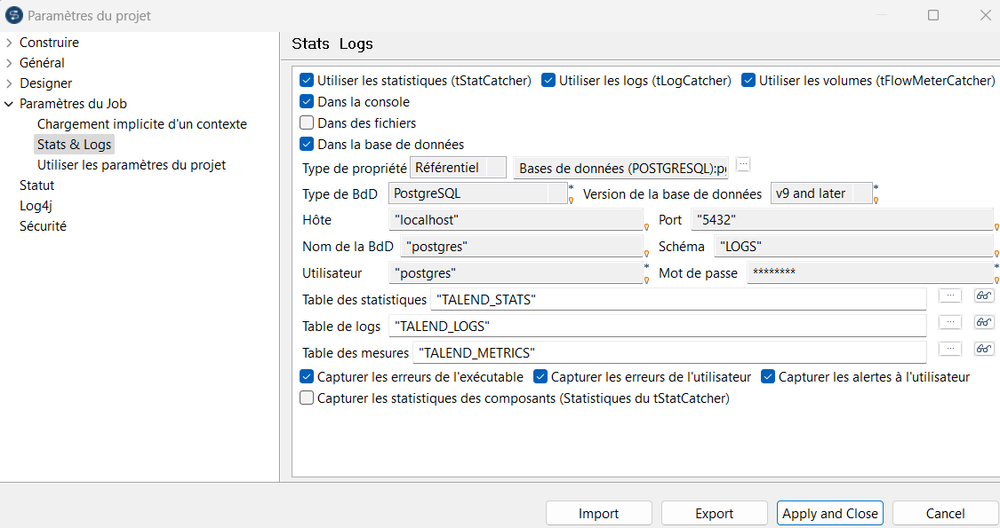

<head>
<style>
#titleMain {color:#808080; font-size:40px; font-weight:bold; font-family:"Cambria"}
#titleSub {color:#677179; font-size:30px; font-weight:bold; font-family: "Verdana"; margin-top:30px; margin-bottom:25px}
#titleSub2 {color:#563C5C; font-size:20px; font-weight:bold; margin-bottom:20px}
#titleSubSub {}
#com {color:#FF00FF; font-size:18px "Carnivalee Freakshow"}
#par {color:#32CD32; font-size:18px "Carnivalee Freakshow"}
#val {color:#87CEFA; font-size:18px "Carnivalee Freakshow"}
#imp {color:#e21313; font:bold 20px "Carnivalee Freakshow"}
#def {color:#90EE90; font-size:18px "Carnivalee Freakshow"}
#not {color:#1E90FF; font-size:18px "Carnivalee Freakshow"}
#att {color:#ffa500; font-size:18px "Carnivalee Freakshow"}
.video-responsive {
 overflow:hidden;
 padding-bottom:56.25%; 
 position:relative;
 height:0;
}
.video-responsive iframe {
 left:0;
 top:0;
 height:100%;
 width:100%;
 position:absolute;
}
</style>
</head>

# <span id="titleMain">Talend : bases et bonnes pratiques</span>

## <div id="titleSub">0. Les bonnes pratiques</div>
<br>

## <div id="titleSub2">0.1 Afficher la RAM utilisée</div> 

Dans la barre des menus (en haut à gauche)

1. Cliquer sur "Fenêtre"
2. Cliquer sur "Préférences"

Une nouvelle fenêtre vient d'apparaître 

3. Cliquer sur "Général"
4. Cocher "Show heap status"
5. Cliquer sur "Apply and close"

Normalement, on constate l'élément suivant en bas de la fenêtre


## <div id="titleSub2">0.2 Référentiel > Built-in</div> 

On préférera largement utiliser le référentiel plutôt que l'option built-in, car si une modification est à réalisé et qu'elle a un impact sur plusieurs flux d'un même projet:

| Choix | Action(s) |
| ----- | ----------- |
| Référentiel | modification dans les métadatas |
| Built-in | modification dans tous les composants de tous les flux |

## <div id="titleSub2">0.3 Ajouter un preJob et un postJob</div>

En général, on ouvre un connexion à une base de donnée en tout début de process et on l'interromp en fin de process, comme dans l'exemple ci-dessous:


## <div id="titleSub2">0.4 Récupération des informations liées aux logs</div>

Il est recommandé d'afficher ces informations dans la console et de les stocker dans une bases de données:

<span id="not">Si les tables n'existent pas alors Talend se chargera de les créer.</span><br>

Pour se faire:

1. Cliquer sur "Fichier"
2. Cliquer sur "Modifier les propriétés du projet"

Une nouvelle fenêtre vient d'apparaître, saisir les informations comme l'exemple ci-dessous:



## <div id="titleSub">98. Les questions en suspend</div>

Bonnes pratiques :

- Passer par un fichier de contexte (externalisation de contexte) OK mais comment gérer ce problème de mot de passe en clair pour l'accès aux bases de données
- Contruction d'une metadata à partir du contexte et initialisation du contexte à partir du fichier de contexte. Mais comment mettre à jour les metadatas liés à la connexion sans la modifier
- Lorsque l'on exporte le contexte d'une metadata, on ne peut pas ajouter d'autre variable de contexte? Par exemple: dans le cas d'une connexion à une base de données PostGre SQL ça ne requiert pas le nom de la table
  


<span id="com">Nom_Fonction </span>
<span id="par">Paramétre</span>
<span id="val"> Valeur </span>

Pour croiser les informations de différentes tables on réalise des <span id="imp">jointures</span>.<br>
<span id="def">Base de données: outils permettant de stocker et de structurer nos données.</span><br>
<span id="not">Toutes les requêtes SQL suivent un plan d'exécution qui peut être optimisé (Demander de l'aide à un DBA orienté analyse).</span><br>
<span id="att">DBeaver est un logiciel qui réalise un lock sur une table lors d'un select.</span><br>

## <div id="titleSub">1. Titre</div>

## <div id="titleSub2">1.1 Sous-titre</div> 

## <div id="titleSub">2. Joindre une image</div>

![image info] (<span id="param">Chemin relatif du fichier image</span>)

## <div id="titleSub">3. Les styles</div>

*En italic*<br>
**En gras**<br>
<u>Souligné</u><br>
<mark>Surligné en jaune</mark><br>

## <div id="titleSub">4. Mise en évidence</div>

La mise en évidence c'est ça : `<Accepter>`, ni plus ni moins.<br>
Rappel : Alt Gr + 7<br>

## <div id="titleSub">5. Trois façons de créer une barre horizontale</div>

---

***

___


## <div id="titleSub">6. Créer un bloc avec coloration syntaxique</div>

```json
{
  "firstName": "John",
  "lastName": "Smith",
  "age": 25
}
```

```xml
<?xml version="1.0" encoding="utf-8"?>
<Root>
  <Customers>
    <Customer CustomerID="GREAL">
      <CompanyName>Guerin ravitaille</CompanyName>
    </Customer>
</Root>
```

## <div id="titleSub">7. Créer des blocs imbriqués</div>

>Bloc père

>>Premier bloc fils<br>
>>seconde ligne du bloc

>>Second bloc fils<br>
>>seconde ligne du bloc

## <div id="titleSub">8. Créer un lien</div>

Texte avant mon lien [Nom du site](https://google.com) texte après mon lien.
<br>  


## <div id="titleSub">9. Liste ordonnée</div>

1. Premier
2. Second
3. Troisième

## <div id="titleSub">10. Liste non ordonnée</div>

* Maillot de bain
* Serviette
* Savon

## <div id="titleSub">11. Réaliser un tableau à 2 entrées</div>

| Numéro | Département |
| --- | ----------- |
| 02 | Ainse |
| 60 | Oise |
| 80 | Somme |

## <div id="titleSub">12. Liste de cases à cocher</div>

- [x] Write the press release
- [ ] Update the website
- [ ] Contact the media

## <div id="titleSub">13. Intégrer une vidéo youtube</div>

- [ ] Visibilité via la preview de VS Code
- [x] Visibilité via un navigateur web

<div class="video-responsive">
  <iframe 
    width="560" 
    height="315" 
    src="https://www.youtube.com/embed/caXHwYC3tq8" 
    title="YouTube video player" 
    frameborder="0" 
    allow="accelerometer; autoplay; clipboard-write; encrypted-media; gyroscope; picture-in-picture" 
    allowfullscreen>
  </iframe>
</div>